# MicroServicesOnDocker
check out https://training.play-with-docker.com/

```sh
Install Docker EE - Windows
Install-Module DockerProvider -Force
Install-Package Docker -ProviderName DockerProvider -Force
```
## Install Docker EE - Linux
```sh
wget -qo- https://get.docker.com/ | sh
```
visit https://docs.docker.com/install/linux/docker-ee/ubuntu/
#### run docker with dev user in admin mode no need for sudo
```sh
sudo usermod -aG docker dev
```
This worked : https://upcloud.com/community/tutorials/how-to-configure-docker-swarm/
```sh
sudo apt-get install curl -y
curl -sSL https://get.docker.com/ | sh
sudo service docker stop
sudo usermod -aG docker <username>
```

### Architecture and Theory
- container : Isolated area of an OS with resource usage limits applied
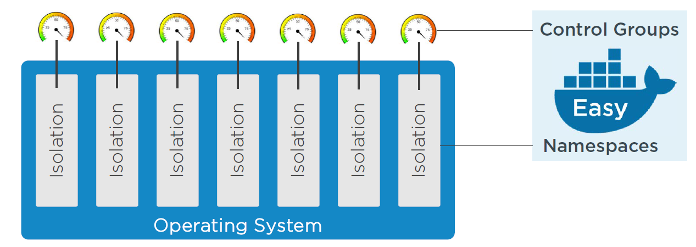

To build a container, we leverage a bunch of low-level kernel construct, hence the namespaces and control groups,are low-level kernel construct which been around for longtime in Linux remained obscure and esoteric, hard to work with

The Docker engine :
- API : single end-point interface used through the CLI
- Engine

### Simple Workflow : 
1 - use the command line to create a new container

2 - client takes the command and makes the appropriate API request to the container

3 - engine pulls together all of the required kernel pieces and pops out  a container! 

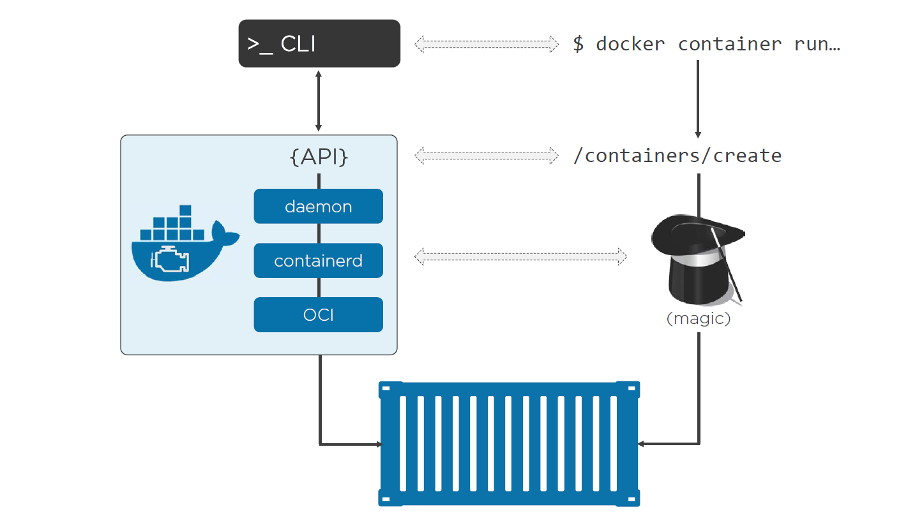

**Namespaces** : are about isolation, OS carve into multiple, isolated, virtual operating systems with all of its resources, i.e high-level
constructs with its own containerized root file system, processed tree and zero interface, users,... sharing a single kernel on a host, On the other hypervisor takes a physical machine and curves into into multiple virtual machine with their own CPU, virtual memory, virtual networking, virtual storage...

- **Hypervisor world** : each one like a fullblown machine
- **container world** : each one like a Os with its secured boundery

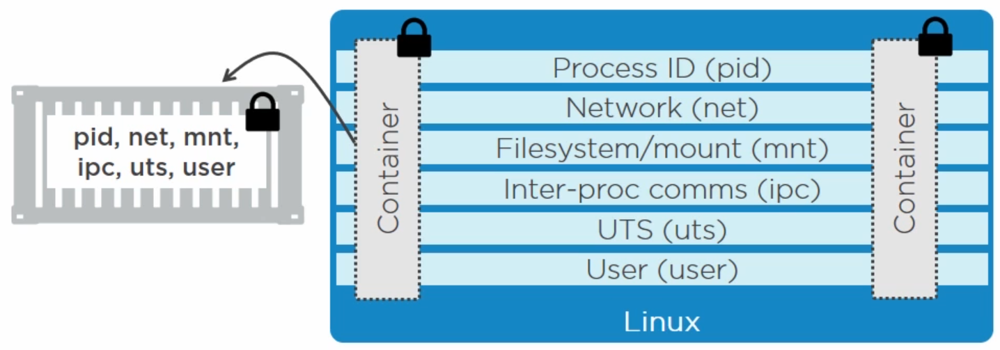

- **PID**: the *Namespace* gives each container its own isolated process tree, unaware of any other container existance
- network :the *Namespace* gives each container its own isolated network stack, IP's rooting tables
- Mount : gives a container its own isolated root file system
- IPC : lets processes in a single container access the same shared memory, and stops everything from outside container,
- UTS: gives everything its own host name,
- username space: new to Docker, lets map accounts inside the container to different users on the host.e.g. root user and a non-privileged user on a host.

**Control groups (aka C-groups)**: supervises/limits the consumption of system resources. In **Windows world** they are called **Job Objects**, like Namespaces are meant to group processes by container, C-groups imposes limits (amount of CPU, memory, disk IO...) on a container. 
Namespace and Control Groups gives a workable containers in a union file system, combining read-only file systems or blocked devices, adding them on the top of the readonly (image) layer => presenting them to the system as a unified view. 

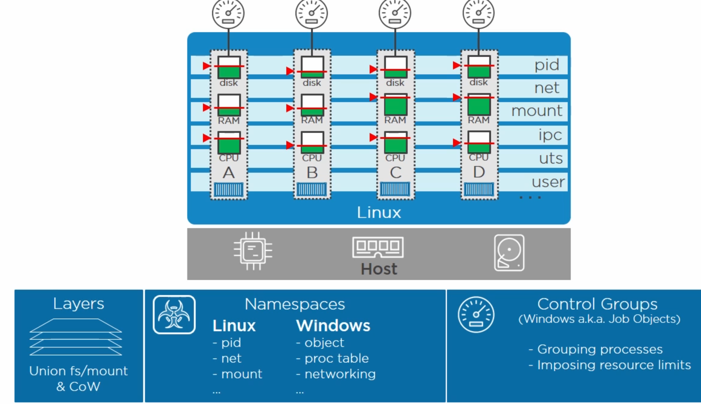


**The Docker engine**
- Docker client: execute commands like Docker Container Run (or just 'docker Run')
- Daemon: implementing the rest API
- Container D: is the container that supervises and handles execution and lifecycle operations, e.g. start, stop, pause and unpause, and 
- OCI (Open Container Initiative) layer: interfaces with the kernel. 

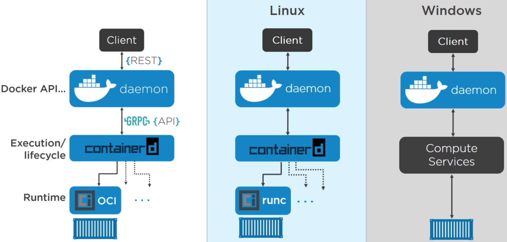


**Linux Workflow**:
1 - The client asks the daemon for a new container. 
2 - The daemon gets Container D to start and manage the containers, and runs C at the OCI layer (actually builds them) 
3 - Run C is the reference implementation of the OCI runtime spec (Docker vanilla installation)

**Windows Workflow**:
1 - The client asks the daemon for a new container.
2 - The daemon gets Compute Services layer (instead of Container D in the OCI layer) to start and manage the containers

Those differences are there because when MS was shipping Server 2016, at the same time Docker was refactoring into Container D and Run C 
**OCI** = Open Containers Initiative : It contains 2 specifications: the Runtime Specification (runtime-spec) and the Image Specification (image-spec). The Runtime Specification outlines how to run a “filesystem bundle” that is unpacked on disk. At a high-level an OCI implementation would download an OCI Image then unpack that image into an OCI Runtime filesystem bundle. At this point the OCI Runtime Bundle would be run by an OCI Runtime.

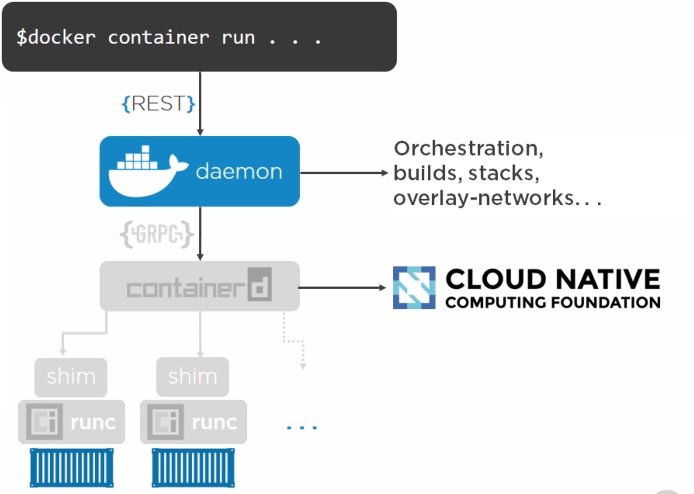

**WorkFlow creating container - Linux**:
1 - The command's docker container run (or just 'docker Run')
2 - The client takes the command posts it as an API request to the container's create endpoint in the daemon. 
3 - Daemon ('capital D') : recent docker engine refactoring has left the daemon without any code to execute run containers which implemented into Container D in the OCI layer 
4 - Container D: the daemon calls out to Container D over a GRPC API on a local Unix socket, can't actually create a container, all the logic to interface with the Namespaces and the kernel is implemented by the OCI
5 - OCI  : Docker on Linux defaults to Run C (we could switch for any OCI compliant runtime)
6 - Shim: The daemon starts Container D, which is a daemon process (i.e. long-running process), which is the glue between the Daemon and Run C, Container D starts a shim process for every container, and Run C creates the container, So Run C gets called for every new container and exit. The shim stay alive instead.

**Run C** is potentially swapable for any OCI compliant runtime, and container D and OCI both reusable as well, so both easily reused by players in the eco-system. 
 
 
**Native Windows containers** (runs blue Win32 apps)
NTSFS and the registry, so that we can get image layering like AUFS and overlay AUFS on Linux. Remember, a union file system or a union mount system with some copy on right is an integral part of a Docker container.

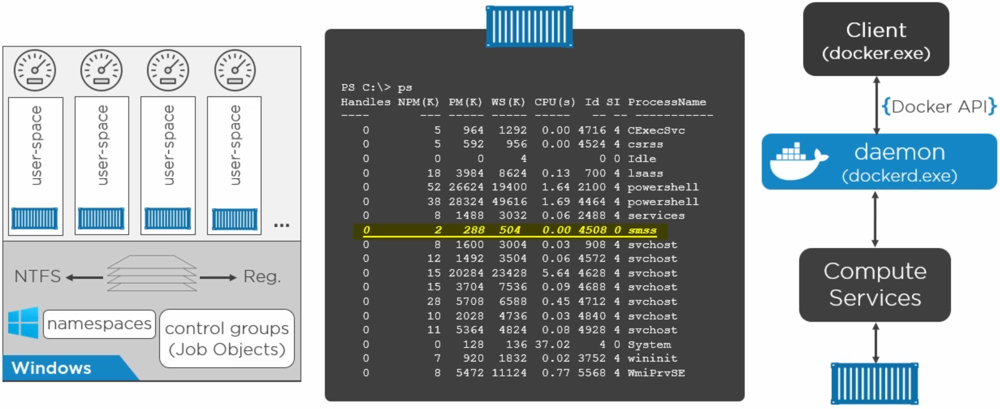

ported a Docker client and daemon into Windows the same API and the same user experience. We didn't get integration with swarm and other docker pieces, low level windows diverges from Linux, we got Compute Service layer.

**Windows** has developed a bunch of interdependencies, so apps need certain systems services, DLLs, to be available, and in turn, some of those rely on others, and if they're not there, things break, and it's not different for containers. Every container needs these processes. When we start a Windows container, it gets this process called SMSS (vs linux init process).

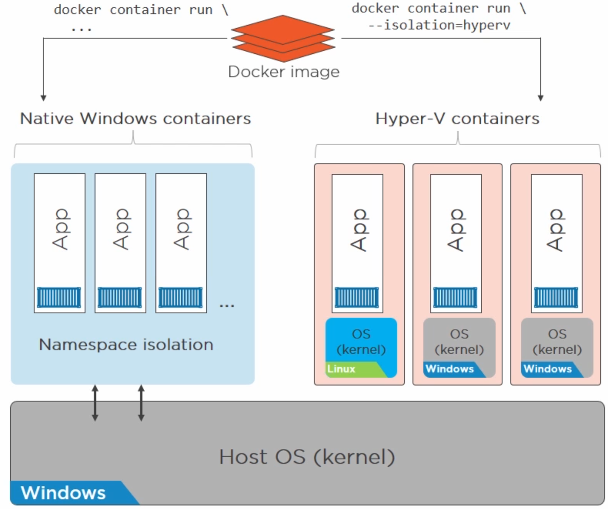
**Native Windows containers** can only run native Win32 apps, and Hyper-V containers Windows actually spins up a lightweight Hyper-V VM in the background (less performance overhead than a full VM), but we still get a full OS, so it's not using the host's kernel, instead a separate isolated kernel, and then we run your container on that. 
**The native containers** spin up, directly on the host, leverage its kernel, and isolation is done with Namespaces, while Hyper-V containers totally isolated kernel, and it can be Windows or Linux inside it's always one container per VM. 
 
It becomes a deployment decision, we develop our containers in Windows, and decide wether native or Hyper-V, by running the Docker run command flag.  


### Image
An image is a ready-only template for creating application containers. images are build-time constructs and containers are their run-time constructs (container = running image, image = a stopped container). An image is set of files and a manifest (i.e. JSON file explaining how it images artifacts fits together) which includes the app files and the library files required by an app to run and (ideally) just the ones it needs to run. Therefore, an image is a set of layers that are stacked on top of each others (i.e. unified file system).
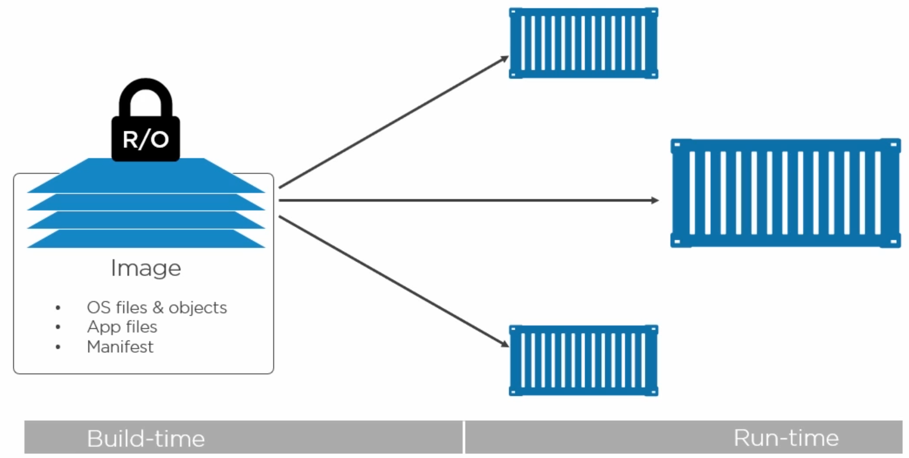
we store images (read-only) in a registry which can be cloud or on premise. We pull them down using the docker image pull command. 
Once on our hosts, we can start containers from them the image is read-only, for each container we create a thin writable layer and effectively lash it on top of the ready-only image. 
 
Image is made of independent layers very loosely connected by a manifest file (aka config file), describes the image, like
its ID and tags and when it was created, most importantly list of the layers that get stacked and how to stack them. 
these layers are unaware of the bigger image. They have no idea that they're stacked up on each other. i.e one layer in image has no references to other layers. 

**Pulling an image is actually a two step process**: 
1 - Get the manifest is also a 2 steps 
 - get fat manifest (aka Manifest list) : list of architectures (my case: docker system info gives Architecture: x86_64) supported and points you to the image manifest 
 - get image manifest : describes the image (e.g. ID, tag, createAt, layers and stack...), it has the hash which is the image id.

2 - pull the layers. 
The image ID is the hash of all image that content in registry's blob store, we downloaded we run the hash again, and see if the two match. 

```sh
docker image pull redis:latest
```
see also docker image push.

Note that docker pull assume Docker Hub registry
to see the hash
```sh
docker image ls --digests
```
We've got crypto giving us immutability and behind the scenes, there's a storage driver pulling together all the layering (overlay2 or aufs).

Linux worlds
-------------
```sh
docker system info

Server Version: 19.03.2
Storage Driver: overlay2
Backing Filesystem: extfs or Root Dir: /var/lib/docker/aufs (Aufs is the oldest driver, overlay2 is the future)
```
**In windows world** images are stored in *c:\programData\docker\windowsfilrer*, in linux world images are stored in /var/lib/docker/<storage-driver> (<storage-driver> = {Aufs,overlay2,... })

From a kernel perspective, it is totally possible to be running a Centos/suze/mint docker host within an ubuntu based containers on it because the **shared kernel** is the same but not windows though.
all images are stored in /var/lib/docker/overlay2 (sudo ls -l /var/lib/docker/overlay2)
```sh
docker history redis


[
    {
        "Id": "sha256:01a52b3b5cd14dffaff0908e242d11275a682cc8fe3906a0a7ec6f36fbe001f5",
        "RepoTags": [
            "redis:latest"
        ],
        "RepoDigests": [
            "redis@sha256:cb379e1a076fcd3d3f09e10d7b47ca631fb98fb33149ab559fa02c1b11436345"
        ],
        "Parent": "",
        "Comment": "",
        "Created": "2019-09-25T22:06:05.071477029Z",
        "Container": "faa4f573d251db6418993e52addb303289e1fb2e2f3766cb5290c878d069e6b9",
        "ContainerConfig": {
            "Hostname": "faa4f573d251",
            "Domainname": "",
            "User": "",
            "AttachStdin": false,
            "AttachStdout": false,
            "AttachStderr": false,
            "ExposedPorts": {
                "6379/tcp": {}
            },
            "Tty": false,
            "OpenStdin": false,
            "StdinOnce": false,
            "Env": [
                "PATH=/usr/local/sbin:/usr/local/bin:/usr/sbin:/usr/bin:/sbin:/bin",
                "GOSU_VERSION=1.11",
                "REDIS_VERSION=5.0.6",
                "REDIS_DOWNLOAD_URL=http://download.redis.io/releases/redis-5.0.6.tar.gz",
                "REDIS_DOWNLOAD_SHA=6624841267e142c5d5d5be292d705f8fb6070677687c5aad1645421a936d22b3"
            ],
            "Cmd": [
                "/bin/sh",
                "-c",
                "#(nop) ",
                "CMD [\"redis-server\"]"
            ],
            "ArgsEscaped": true,
            "Image": "sha256:2f30700f0e3c59583b6745aaaf3a67037465a9c8c88070b2b75829fd03681489",
            "Volumes": {
                "/data": {}
            },
            "WorkingDir": "/data",
            "Entrypoint": [
                "docker-entrypoint.sh"
            ],
            "OnBuild": null,
            "Labels": {}
        },
        "DockerVersion": "18.06.1-ce",
        "Author": "",
        "Config": {
            "Hostname": "",
            "Domainname": "",
            "User": "",
            "AttachStdin": false,
            "AttachStdout": false,
            "AttachStderr": false,
            "ExposedPorts": {
                "6379/tcp": {}
            },
            "Tty": false,
            "OpenStdin": false,
            "StdinOnce": false,
            "Env": [
                "PATH=/usr/local/sbin:/usr/local/bin:/usr/sbin:/usr/bin:/sbin:/bin",
                "GOSU_VERSION=1.11",
                "REDIS_VERSION=5.0.6",
                "REDIS_DOWNLOAD_URL=http://download.redis.io/releases/redis-5.0.6.tar.gz",
                "REDIS_DOWNLOAD_SHA=6624841267e142c5d5d5be292d705f8fb6070677687c5aad1645421a936d22b3"
            ],
            "Cmd": [
                "redis-server"
            ],
            "ArgsEscaped": true,
            "Image": "sha256:2f30700f0e3c59583b6745aaaf3a67037465a9c8c88070b2b75829fd03681489",
            "Volumes": {
                "/data": {}
            },
            "WorkingDir": "/data",
            "Entrypoint": [
                "docker-entrypoint.sh"
            ],
            "OnBuild": null,
            "Labels": null
        },
        "Architecture": "amd64",
        "Os": "linux",
        "Size": 98193890,
        "VirtualSize": 98193890,
        "GraphDriver": {
            "Data": {
                "LowerDir": "/var/lib/docker/overlay2/ed128c90ebe917e393f51b3695b852e02b4bb44b1ca392bd1c6467517ab74985/diff:/var/lib/docker/overlay2/debc32238a435bab9114a13f4bc898012b0d5d217eab1e2ad8f1a284cf02eb92/diff:/var/lib/docker/overlay2/ff2291be442447a93208fb11df7a36cd0d41eb78cd0235e8a2171c99f086b8e2/diff:/var/lib/docker/overlay2/fb4ec09da0171baeb0bc3bcae308641f5c81884069e86db3998ce2fbb4c71025/diff:/var/lib/docker/overlay2/8cabe298f7c2f84a8eaef50e6b4f649df0af0aec85c3b4bc61254b5ce6443e9d/diff",
                "MergedDir": "/var/lib/docker/overlay2/8450251ba5912d25eceba361ff07fe75f0f6eabfb15bb5a1ed30ddc1b36b80f1/merged",
                "UpperDir": "/var/lib/docker/overlay2/8450251ba5912d25eceba361ff07fe75f0f6eabfb15bb5a1ed30ddc1b36b80f1/diff",
                "WorkDir": "/var/lib/docker/overlay2/8450251ba5912d25eceba361ff07fe75f0f6eabfb15bb5a1ed30ddc1b36b80f1/work"
            },
            "Name": "overlay2"
        },
        "RootFS": {
            "Type": "layers",
            "Layers": [
                "sha256:2db44bce66cde56fca25aeeb7d09dc924b748e3adfe58c9cc3eb2bd2f68a1b68",
                "sha256:96550adba4f99ce4ad1e19a0a8a627cb420e762763b852e945d7542d30731d59",
                "sha256:a0e3cc85530d65d60bd1dab00a30bf870924aea38ef3ed72edc127c550923334",
                "sha256:c7fcc133516e8d3b7b8ad20b640915739956b96920e6a8858afad554faf7bd13",
                "sha256:68ffe58b3e9478064c495369565ed4294f5d199d5bd0d1610258ecc2a9bfef37",
                "sha256:6f3fa587ec88f4ae2fade5debdeb0c6d48bc446c4f8702b9824dcf4bee25e95f"
            ]
        },
        "Metadata": {
            "LastTagTime": "0001-01-01T00:00:00Z"
        }
    }
]


```

| IMAGE | CREATED | CREATED BY |SIZE|
| ------ | ------ | ------ | ------ |
| 01a52b3b5cd1|3 days ago|  /bin/sh -c #(nop)  CMD ["redis-server"]| 0B|   
|missing|   3 days ago|  /bin/sh -c #(nop)  EXPOSE 6379|0B|   
|missing|   3 days ago|  /bin/sh -c #(nop)  ENTRYPOINT ["docker-entry…|   0B|   
|missing|   3 days ago|  /bin/sh -c #(nop) COPY file:df205a0ef6e6df89… |  374B| 
|missing|   3 days ago|  /bin/sh -c #(nop) WORKDIR /data|  0B|   
|missing|   3 days ago|  /bin/sh -c #(nop)  VOLUME [/data]|0B|   
|missing|   3 days ago|  /bin/sh -c mkdir /data && chown redis:redis … |  0B|   
|missing|   3 days ago|  /bin/sh -c set -eux;   savedAptMark="$(apt-m…|   24.6MB|  
|missing|   3 days ago|  /bin/sh -c #(nop)  ENV REDIS_DOWNLOAD_SHA=66…|   0B|   
|missing|   3 days ago|  /bin/sh -c #(nop)  ENV REDIS_DOWNLOAD_URL=ht…|   0B|   
|missing|   3 days ago|  /bin/sh -c #(nop)  ENV REDIS_VERSION=5.0.6|      0B|   
|missing|   2 weeks ago| /bin/sh -c set -eux;  savedAptMark="$(apt-ma…|   4.04MB|  
|missing|   2 weeks ago| /bin/sh -c #(nop)  ENV GOSU_VERSION=1.11|0B|   
|missing|   2 weeks ago| /bin/sh -c groupadd -r -g 999 redis && usera…|   329kB|
|missing|   2 weeks ago| /bin/sh -c #(nop)  CMD ["bash"]|  0B|   
|missing|   2 weeks ago| /bin/sh -c #(nop) ADD file:1901172d265456090… |  69.2MB | 

**Note**: IMAGE column gives `missing` for some images because the `command's older than the new storage model` so it gets a bit confused.
Operations (e.g groupadd -r -g 999 redis && usera…) that have 0B aren't layer most of the case is just config the rest are added layers.

```sh
docker image inspect redis 
```
gives us image config and its layers in json file format (a manifest read)

at the bottom, we have layers and their content hashes => they don't match up with the directory names or the image IDs
shown in the pull. 

further up, we see pieces that makes up an image (Working directories, environment variables, network ports,

**Remove all images**
```sh
docker image rm -f $(docker image ls -aq)
docker image rm redis
```

an image is basically a manifest and a set of loosely coupled layers

### Registries
Images live in registries, we pull images by defaut from docker hub registry (Google's, Amazon also have theirs).
we can totally get on premises registries as well. Docker's got its own called Docker Trusted Registry (DTR) 
as part of Docker Enterprise edition.
Docker Hub's got the notion of official and unofficial images (or tags). The official lives at the top level of the Hub namespace. e.g. docker.io/redis where redis is the repo name (or docker.io/nginx)... 
within a registry, we've got repos and within repos, we've got images (aka tags). e.g. we only pull redis, Docker's added latest onto the end if you're not 
explicit about the registry, it assumes Docker Hub (docker.io) and if you're not explicit about the image within the repo (redis or nginx), it assumes latest.

The structure is a follow : ` REGISTRY/REPO/IMAGE(TAG)`

**In windows world** images are stored in ` c:\programData\docker\windowsfilrer` 
**In linux world** images are stored in ` /var/lib/docker/<storage-driver> (<storage-driver>`  = {Aufs,overlay2,... })


```sh
#It will pull all images that matches the architecture.
docker image pull docker.io/redis -a 
```

**There's no such thing as an image**, it's a set of independent layers with a config file that loosely couples them. 
we've got layers containing data and for each one we compute its content hash that we use as its ID. 
when we push an image to a registry :
- We create a manifest that defines the image (its layers)
- We push the manifest and layers independently we compress them
- Compressing a layer, changes its content (content hash, its ID), arriving at the registry, a hash is computed to verify integrity, they fail, they don't match...
- To solve this, when we build the manifest that will push to the registry, we populate it with new hashes of the compressed layers.
- on the host, we've got the uncompressed layers and their content hashes. Over the wire and in the registry's blob store, we've got compressed layers and what we're calling distribution hashes.
  That way, the compressed layers and manifest get pushed to the registry and the registry uses the distribution hashes to verify their integrity.


an **image** is a read-only *_template_* for starting containers and it builds by stacking layers and
having the storage driver make it look like a normal file system. it's not a monolithic blob!

It's a config file plus a set of independent layers. And it's inside these layers where all the
application binaries, and files, and libraries and inside these layers where all the
application artifacts (binaries and files, and libraries...) lives, a config file has the instructions on how to run the image as a container. 
i.e. how to set the environment, which ports to expose, and how to start the packaged app.

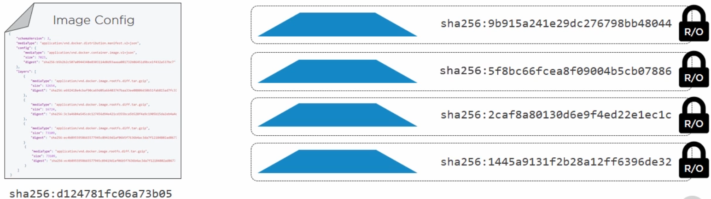

it's normal to start multiple containers per image. Each container gets its own thin writable layer where it stores changes and each one of those
can be linked back to a single image. we get the image ID by running a cryptographic algorithm over the contents of a layer
which makes the image and its layers immutable. The image ID, is a hash of the image content kept in the config file.
the hashes change whenever a change in the image config or any of the layers happens. 
When we push images to registries, we compress them and compressing means changing content. 
Thus, we need a second hash to use with the registry. It's a low level implementation detail but it can make
matching things up on the host hard for us but not for the Docker engine (it keeps a mapping between content ID and distribution ID). 

### Containerizing an App

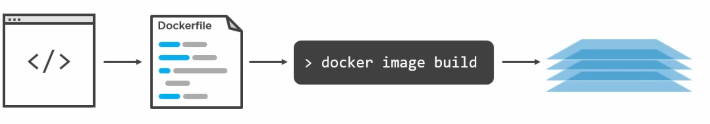


**Dockerfile**: a good practice to name Dockerfile, all one word and put it the root folder of the app. is a list of instructions on how to build an image with an app inside. it's also going to document the app (description app to the rest of the team).
```sh
#base image that we add our app on top of (adding a base layer)
FROM alpine
#list myself as the maintainer => adds a bit of metadata to the image config
LABEL maintainer="use-your-own-email"
#app node requires node and npm to be installed : adding some software to the image, so we get a new layer
RUN apk add --update nodejs nodejs-npm
#copy everything from the same directory as Dockerfile, into /src in the image (adding more content => new layer)
COPY . /src
#set the working directory to /src => just metadata
WORKDIR /src
#dependencies install : run against whatever is listed in packages.json (adding more content => new layer)
RUN  npm install
#This app listens on port 8080, we'll expose it => just metadata
EXPOSE 8080
#node run an app, with relative path to WORKDIR (./app.js) where app is  => just metadata
ENTRYPOINT ["node", "./app.js"]
```
```sh
#run against docker file, where "." is the current directory where Dockerfile is located
docker image build  -t myapp . 
docker image build --tag myapp .
```

```sh
#Running our app
#8080 docker port mapped to 5000 of the host
docker container run -d --name web1 -p 5000:8080 myapp (or docker run -d --name web1 -p 5000:8080 myapp)
```

```sh

#gives all the mapping container/host 
docker port web1

dev@dev-NUC7i7BNH:psweb$ docker port web1
8080/tcp -> 0.0.0.0:5000 

#to get the IP of the container (works in windows)
docker inspect -f "{{ .NetworkSettings.Networks.nat.IPAddress }}" web1 => give the address on the host

#stops all containers
docker container stop $(docker container ls -aq)


#remove all containers
docker container rm -f $(docker container ls -aq)
```

Only include code needed in the **build context**, because build context (where the code is located, e.g. /src) it gets read recursively, 
everything in build context get sent to the Daemon even subfiles that we don't need, a lot resources waste especially if Daemon's across the network.

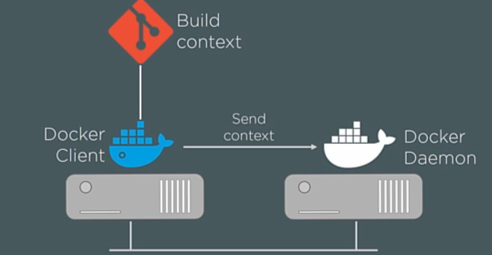

It is possible to have clients talking to remote **Daemons** over the network. a **build context** can be a remote Git repo for instance.

```sh
#build context as a git repo
docker image build -t githubweb https://github.com/nigelpoulton/psweb.git

docker image history githubweb
docker image inspect githubweb
```
>> Note that the id's between image history and image inspect command don't match, because the inspect one gives distribution ID (content hash after compression) and history give the content ID (content hash)

### Multi-stage Builds

Smaller images means faster builds, faster deployments, less money wasted on storage, and most of all less attack surface. 
runing apps with minimal OS and minimal supporting packages, that is the gold standard. 
if we could run our apps with only commands, without any OS at all that the way to go! (check out **Unikernels**)

we start out with a pretty big image that's got a shedload of packages and build tools that we don't need we end up with a huge image 
it's like  building a car in geant factory with robots and lifters and paints stations, and then shipping the car with the factory still attached ot it!.

A multi-stage builds is an official simple support to technology from the core Docker project with a single **Dockerfile**

### .Net example
```sh
FROM microsoft/dotnet:2.0-sdk AS build-env
WORKDIR /app

# copy csproj and restore as distinct layers
COPY *.csproj ./
RUN dotnet restore

# copy everything else and build
COPY . ./
RUN dotnet publish -c Release -o out

# build runtime image
FROM microsoft/dotnet:2.0-runtime 
WORKDIR /app

#avoid carrying out everything from sdk
COPY --from=build-env /app/out ./
ENTRYPOINT ["dotnet", "dotnetapp.dll"]
```


#### Java example (General) : multiple FROM instructions, three in this example
```sh
FROM node:latest AS storefront
WORKDIR /usr/src/atsea/app/react-app
COPY react-app .
RUN npm install
RUN npm run build

FROM maven:latest AS appserver
WORKDIR /usr/src/atsea
COPY pom.xml .
RUN mvn -B -f pom.xml -s /usr/share/maven/ref/settings-docker.xml dependency:resolve
COPY . .
RUN mvn -B -s /usr/share/maven/ref/settings-docker.xml package -DskipTests

FROM java:8-jdk-alpine As Production
RUN adduser -Dh /home/gordon gordon
WORKDIR /static
COPY --from=storefront /usr/src/atsea/app/react-app/build/ .
WORKDIR /app
COPY --from=appserver /usr/src/atsea/target/AtSea-0.0.1-SNAPSHOT.jar .

#Last step : Tell how the app should run!
ENTRYPOINT ["java", "-jar", "/app/AtSea-0.0.1-SNAPSHOT.jar"]
#Since the ENTRYPOINT is specified the CMD become arguments to ENTRYPOINT, otherwise just commands
CMD ["--spring.profiles.active=postgres"]

```

Each **FROM** marks a distinct build stage with friendly names (**storefront**, **appserver**, **Production**), each stage spits out an image with a bunch of OS and build tools + a tiny app-related piece of code that we want at runtime. We end up with four images with a ton of build machinery inside.

**Smaller images** means faster builds, faster deployments, less money wasted on storage, and most of all less attack surface. Runing apps with minimal OS and minimal supporting packages, that is the gold standard. if we could run our apps with only commands, without any OS at all that the way to go! (check out **Unikernels**)

We start out with a pretty big image that's got a shedload of packages and build tools that we don't need we end up with a huge image it's like  building a car in geant factory with robots and lifters and paints stations, and then shipping the car with the factory still attached ot it!.

A multi-stage builds is an official simple support to technology from the core Docker project with a single Dockerfile
production stage : we're starting from the Java Alpine image, which smaller than the node and maven images,
the magic of multi-stage builds really comes into play:
- `COPY --from=storefront /usr/src/atsea/app/react-app/build/ .`
- `COPY --from=appserver /usr/src/atsea/target/AtSea-0.0.1-SNAPSHOT.jar .`

The **COPY --from=storefront** picks out just the app code needed from storefront build stage image and leaves the rest of the image behind!
the same for **COPY --from=appserver**,  pulling out just the app code needed from appserver build stage image and leaves the rest of the image behind!

We could run the same command as before
```sh
docker image build -t mymultistageproject <BUILD_CONTEXT_FOLDER>
```

#### Deployable image is tiny in comparison to other stage images
```sh
docker image ls 
```

### Working with Containers

In **Docker world**, the most atomic unit of scheduling is the container (short-lived and immutable), it's the smallest unit of work we can create. in the virtualization world, that's the VM and In the Kubernetes world, it's the pod.
containers are running instances of images which are Read-only set of layers (build-time here vs run-time)
is a thin, containers are a tiny unique and separate writeable layer on top of a read-only image and which links back to that image. 
All changes happen in the  writeable container layer which is done through union file systems or union mounts... 
all of this layering and stacking gets hidden and made look like a single unified layer.

**Images are R/O**, anytime the container needs write a change to an existing file, it makes its image copy and writes the changes to it writable layer, that way the shared baseline image is not to be touched!

Instead of virtualizing hardware resources like `VM/hypervisor`, **containers** are virtualizing operating system resources 
(e.g.  file systems, process trees, networks stacks), from a a life cycle perspective, we can start, stop, restart, pause, and delete containers.

>>**Linux containers** need a Linux kernel. **Windows containers**, they need a Windows kernel. Apps for Linux, are only going to run as Linux containers on a Linux Docker host (the same goes for Windows). **Containers** are all about **apps** and have `no kernel` inside them. We can run Linux containers on a Windows machine,  but there's magic going on to make it happen.

**containerized apps** are often used in **microservices** where each container generally runs a single process and has a
single job. we break each function out into its own container and then we glue everything together with APIs (simple, documented, and versioned APIs), The point is at the container level is where we keep the container as small and simple as possible. We can also run some of more traditional apps in containers.
**In the Linux world**, it'susually going to be a single process per container and that process does a single job. 

### Diving Deeper
`We normally don't log into containers but we could!` 
```sh
# it for interactive terminal, alpine =image, run a sh shell inside the image
docker container run -it alpine sh  (short hand: docker run -it alpine sh)
```
**Inside the sh run ps -elf to show the processes running inside alpine container***

Use **ctrl+p ctrl+q** to get out of the container, `but container is still running`
```sh
dev@dev-NUC7i7BNH:psweb$ docker run -it alpine sh
/ # ps -elf
PID   USER     TIME  COMMAND
    1 root      0:00 sh
    6 root      0:00 ps -elf
/ # 
```
>>**ps -elf** is already exited that left us with sh only.
```sh
docker container run -d alpine sleep 1d
```
```sh
#42 : first two charaters of the ID for the uniqueness
docker container stop 42
```
**Stopping a container** sends a signal to the main process in the container, PID1. If that process knows what to do with the signal, then it stopped. But if it doesn't know what to do with the signal,then Docker gives it a 10 second grace period, after which it forces it to stop (our example here).
```sh
#42 : first two charaters of the ID for the uniqueness
docker container start 42
```
Any data that we might have saved into a **container** before we stopped it is still going to be there until it gets removed. We could add data into container although we should do it through **volumes**, the containers should remains `ephemerals` and `immutables`.

##### Testing with newFile.txt file instead of volume!, stoping and starting a container doesn't destroy it data
```sh
#42 : first two charaters of the ID for the uniqueness
docker container exec -it 42 sh
/ # ps -elf
PID   USER     TIME  COMMAND
    1 root      0:00 sleep 1d
    6 root      0:00 sh
   11 root      0:00 ps -elf
/ # echo "new file" > newFile.txt
/ # cat newFile.txt 
new file
/ # exit
dev@dev-NUC7i7BNH:psweb$ 
docker container stop 42
docker container start 42
```
```sh
dev@dev-NUC7i7BNH:psweb$ docker container exec -it 42  ls -al
total 68
drwxr-xr-x    1 root     root          4096 Sep 29 15:27 .
drwxr-xr-x    1 root     root          4096 Sep 29 15:27 ..
-rwxr-xr-x    1 root     root             0 Sep 29 14:52 .dockerenv
drwxr-xr-x    2 root     root          4096 Aug 20 10:30 bin
drwxr-xr-x    5 root     root           340 Sep 29 15:29 dev
drwxr-xr-x    1 root     root          4096 Sep 29 14:52 etc
drwxr-xr-x    2 root     root          4096 Aug 20 10:30 home
drwxr-xr-x    5 root     root          4096 Aug 20 10:30 lib
drwxr-xr-x    5 root     root          4096 Aug 20 10:30 media
drwxr-xr-x    2 root     root          4096 Aug 20 10:30 mnt
-rw-r--r--    1 root     root             9 Sep 29 15:27 newFile.txt
drwxr-xr-x    2 root     root          4096 Aug 20 10:30 opt
dr-xr-xr-x  315 root     root             0 Sep 29 15:29 proc
drwx------    1 root     root          4096 Sep 29 15:27 root
drwxr-xr-x    2 root     root          4096 Aug 20 10:30 run
drwxr-xr-x    2 root     root          4096 Aug 20 10:30 sbin
drwxr-xr-x    2 root     root          4096 Aug 20 10:30 srv
dr-xr-xr-x   13 root     root             0 Sep 29 15:29 sys
drwxrwxrwt    2 root     root          4096 Aug 20 10:30 tmp
drwxr-xr-x    7 root     root          4096 Aug 20 10:30 usr
drwxr-xr-x   11 root     root          4096 Aug 20 10:30 var
```
```sh
dev@dev-NUC7i7BNH:psweb$ docker container exec -it 42  cat  newFile.txt
new file
dev@dev-NUC7i7BNH:psweb$ 
```
```sh
#remove all containers and check if the file still exists
docker container rm -f $(docker container ls -aq)
```

```sh
#no need to specify container with run!
docker run -it alpine sh
```
Here the **app** is the **sh** (the **shell**), when exiting the sh we kill the **container** but if we use  ctrl+p ctrl+q we  get out of the container without killing the shell, so `container is still running`.
>>Every image has a default process that it'll run if we don't tell it something different at run-time (inspect image an check out **"Cmd": ["/bin/sh"]** in config file). 

```sh
#So if we inspect the alpine image
docker image inspect alpine
```

We got :  **"Cmd": ["/bin/sh"]**.  We can override this when we start the container. A bit like we did with the sleep container:
```sh
docker container run -d alpine sleep 1d
```
Anything that we tell "it" to run at run-time is going to overwrite the default cmd. An exception to that rule when the container is built with the entrypoint instruction instead of cmd, then anything passed in at run-time gets appended to **ENTRYPOINT** (e.g. **ENTRYPOINT ["dotnet", "dotnetapp.dll"]**) as an argument.


### Logging
- Two types of logs:
    - daemon logs : are the logs from the Docker Daemon or the Docker engine,
		modern Linux systems use systemd, in those instances, daemon logs get sent to journald (journalctl -u docker.service) if not check var/log/messages. On Windows check **AppData/Local/Docker**and also **Windows event viewer**.
    - container (aka app) logs: Docker's hoping that apps log to STDOUT and STDERR. i.e. PID1 process in every container is getting captured and it's getting forwarded  we need to design the containers so the apps are running as PID1 and logging to STDOUT and STDERR, we could also logging to a file though, it is possible to do sim links and shunt rights to those files to STDOUT and STDERR; maybe mount a volume to those locations so that you can access them outside of the container and make sure they persist when the container's gone. Enterprise edition has supported the logging drivers-plugins that integrate container logging with existing logging solutions like Syslog and Gelf and Splunk,     => forward container logs to whatever external logging solution.


we could configure logging driver for the system via daemon.json config file. Then any new containers will start using that driver. for the occasional container logging : 
```sh 
docker run --log-driver --log-opts 
```
>>Most Docker hosts default to **JSON file logging**. This writes out logs to a simple JSON file format.
```sh 
#to view them and to follow them.
docker logs <container> [--follow]
```

### Swarm

A Swarm is a secure cluster of Docker nodes (i.e. giant Docker node), we can run work against it (vs individual nodes) in Native Swarm or Kubernetes mode. It comes in two parts:
- The Secure cluster: 
									- It shipped with Docker Enterprise Edition and at the highest level, it's a cluster of Docker nodes( containered and the OCI, including native support for Kubernetes)
									- The Secure cluster: managers and workers, communicating through Mutual TLS (encrypted network) where workers and managers mutually authenticate each other.
									- It has an encrypted cluster stores, which gets automatically distributed to all managers, we  use labels to tag nodes and customize the cluster
									- It also does all of the workload balancing.

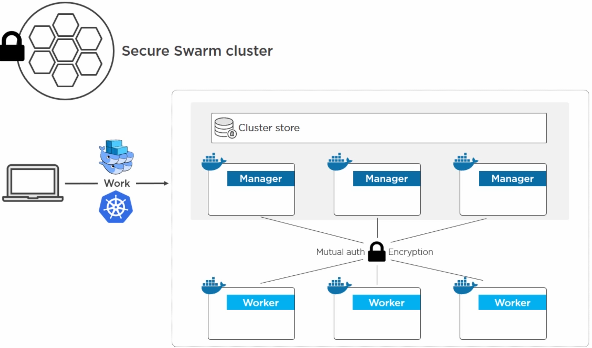	
	
- The Orchestrator: not quite as strategic,Swarm orchestration will give way to Kubernetes, we can run two types of work on the cluster; Native Swarm work, and Kubernetes. 
 
 Docker is a set of bundled packaged tools in a slick API such as  Mobi engine and containered, runC and SwarmKit.


SwarmKit: to build an open source all of the small component  tooling, it also got integrated into the Docker engine, but still available as a separate toolkit.
the goal is to allow to two types of config: docker single-engine mode (one node), and Swarm mode (cluster mode).
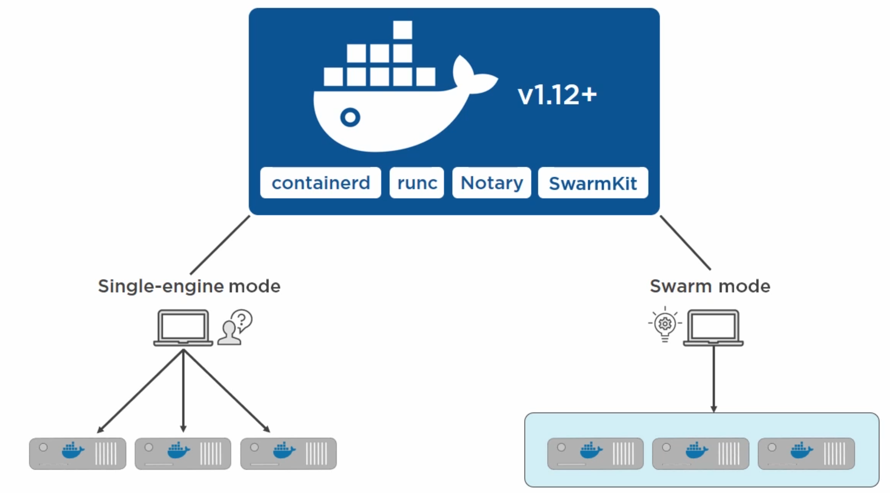	

```sh 
#to create a swarm
docker swarm init
```
Docker switches to Swarm mode, we get the first manager of the Swarm which also a leader. It's the root CA of the Swarm.

```sh 
#we can also configure external CAs 
docker swarm init --external CA
```
Swarm out of the box  issued itself a client certificate, built a secure cluster store, which's ETD and it get distributed to every other manager in the Swarm including a default certificate rotation policy and created a set of cryptographic join tokens; one for joining new managers, and another for joining new workers.

```sh 
#to add new node to the swarm (new manager)
docker swarm join
```
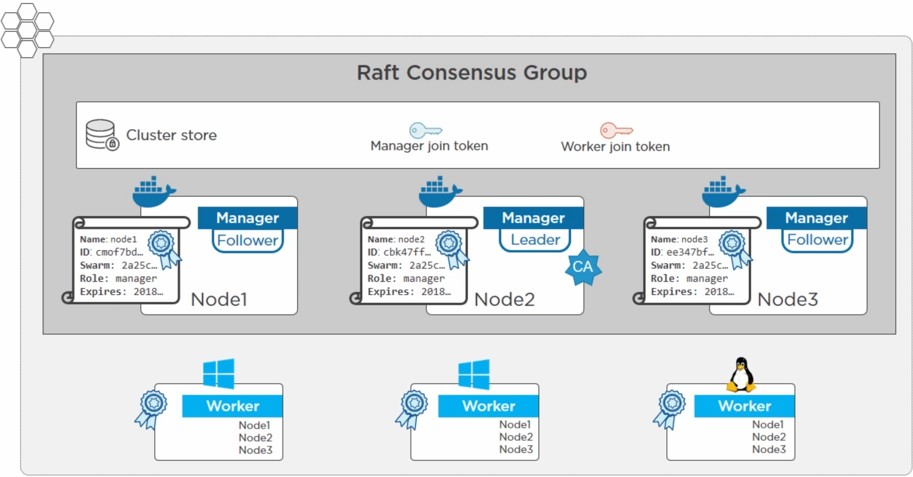	

Every Swarm has a single leader manager with  follower managers (Raft terminology), a new manager gets cryptojoin token for managers, the cluster store's been extended to it.  issued its own client certificate which identifies it  as a Swarm member with a  manager role.  

When a commands is issued at the cluster, if we hit a follower manager, it's going to proxy commands to the leader. when a leader fails, we have an election and one of the followers gets elected as a new leader (managed by Raft as in Kubernetes). It is important to connect your managers over decent, reliable networks avoid putting them cross region.  we can also have a mix of Linux and Windows running hybrid apps. 


The workers do all the application work on a Swarm that's either a native Swarm work or it's Kubernetes, when we make a worker join a Swarm, it does not get access to the cluster store(only for managers), but each worker get the full list of IPs managers, if one of them dies, the workers can just talk to the others, they get their own certificates which identifies who the worker is, the Swarm that it's a member of, and what its role is: worker...

Swarm is a  cluster of managers and workers, a full-on PKI where the lead manager is the root CA, and it issues every node with a client certificate that gets used to a mutual authentication, role authorization, and transport encryption, in addition to distributed encrypted cluster store, cryptographic join tokens, and load balancing.

 By default docker is on a single engine mode , i.e  Swarm: inactive 

```sh 
#check swarm if active
docker system info

...
 Plugins:
  Volume: local
  Network: bridge host ipvlan macvlan null overlay
  Log: awslogs fluentd gcplogs gelf journald json-file local logentries splunk syslog
 Swarm: inactive
 Runtimes: runc
 ...
```

```sh 
#init  swarm
docker swarm init --advertise-addr 192.168.0.156


Swarm initialized: current node (yq3d7yo9tanwe64lbw5xq9sme) is now a manager.

To add a worker to this swarm, run the following command:

    docker swarm join --token SWMTKN-1-4dzptuye5bokkfx7uz5zvsod8aye2fqj8uxexm07jpkqe2hdw8-1o7640pdixtf8egrr8g7qc6bl 192.168.0.156:2377

To add a manager to this swarm, run 'docker swarm join-token manager' and follow the instructions.

```

```sh 
#check swarm if active
docker system info

Client:
 Debug Mode: false

Server:
 Containers: 3
  Running: 0
  Paused: 0
  Stopped: 3
 Images: 14
 Server Version: 19.03.2
 Storage Driver: overlay2
  Backing Filesystem: extfs
  Supports d_type: true
  Native Overlay Diff: true
 Logging Driver: json-file
 Cgroup Driver: cgroupfs
 Plugins:
  Volume: local
  Network: bridge host ipvlan macvlan null overlay
  Log: awslogs fluentd gcplogs gelf journald json-file local logentries splunk syslog
 Swarm: active
  NodeID: yq3d7yo9tanwe64lbw5xq9sme
  Is Manager: true
  ClusterID: lde6yf7urp8efqvfgr0cannr4
  Managers: 1
  Nodes: 1
  Default Address Pool: 10.0.0.0/8  
  SubnetSize: 24
  Data Path Port: 4789
  Orchestration:
   Task History Retention Limit: 5
  Raft:
   Snapshot Interval: 10000
   Number of Old Snapshots to Retain: 0
   Heartbeat Tick: 1
   Election Tick: 10
  Dispatcher:
   Heartbeat Period: 5 seconds
  CA Configuration:
   Expiry Duration: 3 months
   Force Rotate: 0
  Autolock Managers: false
  Root Rotation In Progress: false
  Node Address: 192.168.0.156
  Manager Addresses:
   192.168.0.156:2377
 Runtimes: runc
 Default Runtime: runc
 Init Binary: docker-init
 containerd version: 894b81a4b802e4eb2a91d1ce216b8817763c29fb
 runc version: 425e105d5a03fabd737a126ad93d62a9eeede87f
 init version: fec3683
 Security Options:
  apparmor
  seccomp
   Profile: default
 Kernel Version: 4.15.0-64-generic
 Operating System: Ubuntu 18.04.3 LTS
 OSType: linux
 Architecture: x86_64
 CPUs: 4
 Total Memory: 31.31GiB
 Name: dev-NUC7i7BNH
 ID: TMY3:26WP:KN7M:RNQE:E6AW:ZCYG:J6AR:3IIX:OVGC:FGBN:JTCJ:F3WO
 Docker Root Dir: /var/lib/docker
 Debug Mode: false
 Registry: https://index.docker.io/v1/
 Labels:
 Experimental: false
 Insecure Registries:
  127.0.0.0/8
 Live Restore Enabled: false

WARNING: No swap limit support

```


```sh 
#check swarm nodes : one node active and it's a leader
docker node ls

ID                            HOSTNAME            STATUS              AVAILABILITY        MANAGER STATUS      ENGINE VERSION
yq3d7yo9tanwe64lbw5xq9sme *   dev-NUC7i7BNH       Ready               Active              Leader              19.03.2

```


```sh 
#adding a manager follower : afterwards Manager status should display Reachable 
docker swarm join-token manager

To add a manager to this swarm, run the following command:

    docker swarm join --token SWMTKN-1-4dzptuye5bokkfx7uz5zvsod8aye2fqj8uxexm07jpkqe2hdw8-69c8p012cnbgm5512em418k7m 192.168.0.156:2377


```

```sh 
#adding another manager follower, we need to switch node (HOSTNAME)
docker swarm join --token SWMTKN-1-4dzptuye5bokkfx7uz5zvsod8aye2fqj8uxexm07jpkqe2hdw8-69c8p012cnbgm5512em418k7m 192.168.0.156:2377
```

We can add as many as we want of manager in different nodes/host 


```sh 
#adding  worker in a node : no status is displayed for the worker
docker swarm join --token worker
```


```sh 
#adding  worker to join a manager : no status is displayed  for the worker
docker swarm join --token SWMTKN-1-4dzptuye5bokkfx7uz5zvsod8aye2fqj8uxexm07jpkqe2hdw8-69c8p012cnbgm5512em418k7m 192.168.0.156:2377 worker
```


```sh 
#adding  worker to join a manager
docker swarm join --token --rotate worker


#get different token
docker swarm join --token SWMTKN-1-4dzptuye5bokkfx7uz5zvsod8aye2fqj8m418k7muxexm07jpkqe2hdw8-69c8p012cnbgm5512e 192.168.0.156:2377

```
>>if we try to join with a worker using an old token we get an error  a valid join token is necessary to join in this cluster, old workers with all token stay in the cluster.

if we want to look at the client cerficate :
```sh 
sudo openssl x509 -in /var/lib/docker/swarm/certificates/swarm-node.crt  -text

Certificate:
    Data:
        Version: 3 (0x2)
        Serial Number:
            05:f7:90:51:55:1b:eb:7e:fd:25:9d:4a:b9:97:66:cb:a1:cb:15:3a
        Signature Algorithm: ecdsa-with-SHA256
        Issuer: CN = swarm-ca
        Validity
            Not Before: Sep 30 04:15:00 2019 GMT
            Not After : Dec 29 05:15:00 2019 GMT
        Subject: O = lde6yf7urp8efqvfgr0cannr4, OU = swarm-manager, CN = yq3d7yo9tanwe64lbw5xq9sme
        Subject Public Key Info:
            Public Key Algorithm: id-ecPublicKey
                Public-Key: (256 bit)
                pub:
                    04:8f:ef:e5:6b:e3:48:6c:98:c9:f9:74:b8:cc:1d:
                    1e:ca:f6:09:9f:5e:32:eb:2e:2c:a3:46:da:59:d1:
                    89:ec:ae:59:25:94:4f:79:45:5b:1b:2e:7e:57:66:
                    96:3e:2b:bf:f4:cd:24:3a:23:cd:50:9b:2a:20:63:
                    77:0d:1e:2c:9f
                ASN1 OID: prime256v1
                NIST CURVE: P-256
        X509v3 extensions:
            X509v3 Key Usage: critical
                Digital Signature, Key Encipherment
            X509v3 Extended Key Usage: 
                TLS Web Server Authentication, TLS Web Client Authentication
            X509v3 Basic Constraints: critical
                CA:FALSE
            X509v3 Subject Key Identifier: 
                A6:19:7A:D9:BE:95:35:54:7E:00:81:5C:30:EA:D5:1D:E7:5A:4B:24
            X509v3 Authority Key Identifier: 
                keyid:C6:FA:23:10:52:92:5E:D5:38:3C:31:32:C7:05:C4:F5:38:AE:D8:98

            X509v3 Subject Alternative Name: 
                DNS:swarm-manager, DNS:yq3d7yo9tanwe64lbw5xq9sme, DNS:swarm-ca
    Signature Algorithm: ecdsa-with-SHA256
         30:46:02:21:00:e2:f8:f0:7c:f0:4a:05:57:9e:3e:cf:37:a1:
         d9:84:2c:07:86:b6:1b:d2:39:ba:37:d9:04:d7:c6:2d:62:4f:
         6c:02:21:00:c1:47:ed:2d:3a:c7:cd:10:9d:8f:89:47:3e:b3:
         ea:84:9c:d4:9c:b1:c9:bc:de:8f:62:31:54:a3:7c:41:8f:78
-----BEGIN CERTIFICATE-----
MIICNjCCAdugAwIBAgIUBfeQUVUb6379JZ1KuZdmy6HLFTowCgYIKoZIzj0EAwIw
EzERMA8GA1UEAxMIc3dhcm0tY2EwHhcNMTkwOTMwMDQxNTAwWhcNMTkxMjI5MDUx
NTAwWjBgMSIwIAYDVQQKExlsZGU2eWY3dXJwOGVmcXZmZ3IwY2FubnI0MRYwFAYD
VQQLEw1zd2FybS1tYW5hZ2VyMSIwIAYDVQQDExl5cTNkN3lvOXRhbndlNjRsYnc1
eHE5c21lMFkwEwYHKoZIzj0CAQYIKoZIzj0DAQcDQgAEj+/la+NIbJjJ+XS4zB0e
yvYJn14y6y4so0baWdGJ7K5ZJZRPeUVbGy5+V2aWPiu/9M0kOiPNUJsqIGN3DR4s
n6OBvzCBvDAOBgNVHQ8BAf8EBAMCBaAwHQYDVR0lBBYwFAYIKwYBBQUHAwEGCCsG
AQUFBwMCMAwGA1UdEwEB/wQCMAAwHQYDVR0OBBYEFKYZetm+lTVUfgCBXDDq1R3n
WkskMB8GA1UdIwQYMBaAFMb6IxBSkl7VODwxMscFxPU4rtiYMD0GA1UdEQQ2MDSC
DXN3YXJtLW1hbmFnZXKCGXlxM2Q3eW85dGFud2U2NGxidzV4cTlzbWWCCHN3YXJt
LWNhMAoGCCqGSM49BAMCA0kAMEYCIQDi+PB88EoFV54+zzeh2YQsB4a2G9I5ujfZ
BNfGLWJPbAIhAMFH7S06x80QnY+JRz6z6oSc1Jyxybzej2IxVKN8QY94
-----END CERTIFICATE-----
```
In the Subject field :  `Subject: O = lde6yf7urp8efqvfgr0cannr4, OU = swarm-manager, CN = yq3d7yo9tanwe64lbw5xq9sme` ,O : Organisation, OU: Organisation Unit, CN: Canonical Name = cryptographic node ID


last field between worker and manager from the swarm doesn't match 

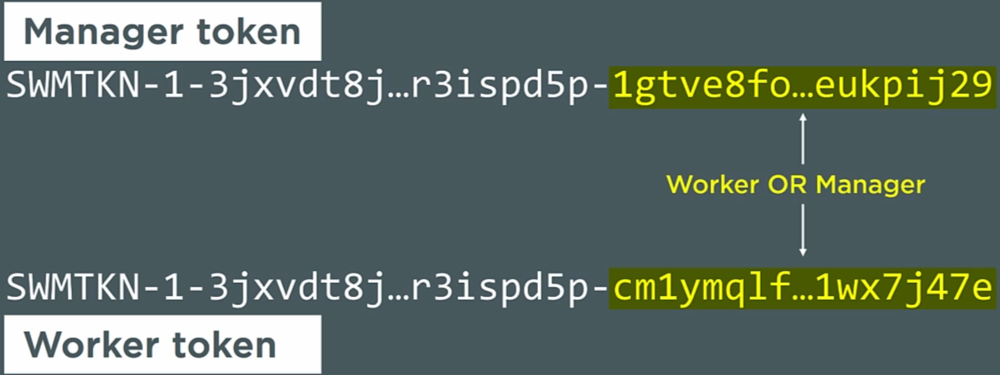	


Restaring a manager is a bit of concern, docker give the possibility to lock a swarm


restarting a manager, or restoring an old backup both present a couple of concerns, Docker gives us the option to lock a Swarm. It's called Autolock. At a high level, it stops restarted managers from automatically rejoining the Swarm. And then
subsequently loading the encryption keys into memory and decrypting the Raft logs, stops you from automatically restoring an old copy of the cluster config.
It will ask for an unlock key, Autolock is not enabled by default, you need to be explicit : 

```sh 
#init  swarm
docker swarm init --advertise-addr 192.168.0.156 --autolock
```
or for existing swarm :

```sh 
#autolock an existing  swarm
docker swarm update  --autolock=true

Swarm updated.
To unlock a swarm manager after it restarts, run the `docker swarm unlock`
command and provide the following key:

    SWMKEY-1-0q/VYgCZaGug9GxupzFne3hiEfnr8vQuzj1eKEPMS/w

Please remember to store this key in a password manager, since without it you
will not be able to restart the manager.

```

restart  docker afterwards

```sh 
#restart  docker
sudo service docker restart

```

```sh 
#inspect the cluser
docker node ls

Error response from daemon: Swarm is encrypted and needs to be unlocked before it can be used. Please use "docker swarm unlock" to unlock it.
```


```sh 
#unlock cluster
docker  swarm unlock 

Please enter unlock key: 
```

```sh 
#inspect the cluser after unlock works
docker node ls
```

```sh 
#to update a certificate in 2 days
docker swarm update --cert-expiry 48h
Swarm updated.
```

```sh 
#check certificate 
docker system info

 Dispatcher:
   Heartbeat Period: 5 seconds
  CA Configuration:
   Expiry Duration: 2 days
   Force Rotate: 0
  Autolock Managers: true
```
