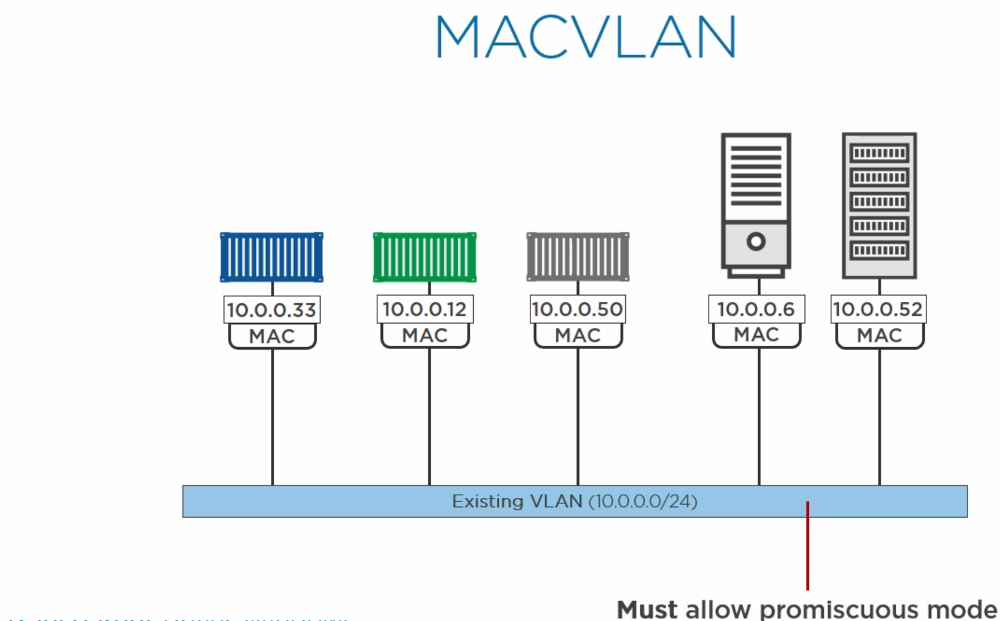

# MicroServicesOnDocker
check out https://training.play-with-docker.com/

### Create a nuget in local:
```sh

dotnet build --no-incremental --configuration Release
dotnet pack --no-build --output C:\packages --configuration Release

In VS Options>Nuget Package Manager>Packge Sources> add a new line 
Name: [Name of local nuget repo] e.g. local
Sources: [Your local Path repo] e.g. C:\packages
```

**[Managing the global packages, cache, and temp folders](https://docs.microsoft.com/en-us/nuget/consume-packages/managing-the-global-packages-and-cache-folders)**

*Cache folder*
```sh
Windows: %userprofile%\.nuget\packages
Mac/Linux: ~/.nuget/packages
```

```sh
Install Docker EE - Windows
Install-Module DockerProvider -Force
Install-Package Docker -ProviderName DockerProvider -Force
```
## Install Docker EE - Linux
```sh
wget -qo- https://get.docker.com/ | sh
```
visit https://docs.docker.com/install/linux/docker-ee/ubuntu/
#### run docker with dev user in admin mode no need for sudo
```sh
sudo usermod -aG docker dev
```
This worked : https://upcloud.com/community/tutorials/how-to-configure-docker-swarm/
```sh
sudo apt-get install curl -y
curl -sSL https://get.docker.com/ | sh
sudo service docker stop
sudo usermod -aG docker <username>
```

## Architecture and Theory
- container : Isolated area of an OS with resource usage limits applied


To build a container, we leverage a set of low-level kernel construct, hence the namespaces and control groups,are low-level kernel construct which been around for longtime in Linux remained obscure and esoteric, hard to work with

The Docker engine :
- API : single end-point interface used through the CLI
- Engine

### Simple Workflow : 
1 - use the command line to create a new container

2 - client takes the command and makes the appropriate API request to the container

3 - engine pulls together all of the required kernel pieces and pops out  a container! 


**Namespaces** : are about isolation, OS carve into multiple, isolated, virtual operating systems with all of its resources, i.e high-level
constructs with its own containerized root file system, processed tree and zero interface, users,... sharing a single kernel on a host, On the other hypervisor takes a physical machine and curves into into multiple virtual machine with their own CPU, virtual memory, virtual networking, virtual storage...

- **Hypervisor world** : each one like a fullblown machine
- **container world** : each one like a Os with its secured boundery


- **PID**: the *Namespace* gives each container its own isolated process tree, unaware of any other container existance
- **network** :the *Namespace* gives each container its own isolated network stack, IP's rooting tables
- **Mount** : gives a container its own isolated root file system
- **IPC** : lets processes in a single container access the same shared memory, and stops everything from outside container,
- **UTS**: gives everything its own host name,
- **username space**: new to Docker, lets us map accounts inside the container to different users on the host.e.g. root user and a non-privileged user on a host.

**Control groups (aka C-groups)**: supervises/limits the consumption of system resources. In **Windows world** they are called **Job Objects**, like Namespaces are meant to group processes by container, C-groups imposes limits (amount of CPU, memory, disk IO...) on a container. 
Namespace and Control Groups gives a workable containers in a union file system, combining read-only file systems or blocked devices, adding them on the top of the readonly (image) layer => presenting them to the system as a unified view. 


**The Docker engine**
- Docker client: execute commands like Docker Container Run (or just 'docker Run')
- Daemon: implementing the rest API
- Container D: is the container that supervises and handles execution and lifecycle operations, e.g. start, stop, pause and unpause, and 
- OCI (Open Container Initiative) layer: interfaces with the kernel. 


**Linux Workflow**:

1 - The client asks the daemon for a new container. 

2 - The daemon gets Container D to start and manage the containers, and runs C at the OCI layer (actually builds containers) 

3 - Run C is the reference implementation of the OCI runtime spec (Docker vanilla installation)

**Windows Workflow**:

1 - The client asks the daemon for a new container.

2 - The daemon gets Compute Services layer (instead of Container D in the OCI layer) to start and manage the containers

Those differences are there because when Microsoft was shipping Server 2016, at the same time Docker was refactoring into Container D and Run C 
**OCI** = Open Containers Initiative, It contains 2 specifications: 
- The Runtime Specification (runtime-spec) 
- and the Image Specification (image-spec). 

The Runtime Specification outlines how to run a “filesystem bundle” that is unpacked on disk. 

At a high-level an OCI implementation would download an OCI Image then unpack that image into an OCI Runtime filesystem bundle. At this point the OCI Runtime Bundle would be run by an OCI Runtime.


**WorkFlow creating container - Linux**:

1 - The command's docker container run (or just 'docker Run')

2 - The client takes the command posts it as an API request to the container's create endpoint in the daemon. 

3 - Daemon ('capital D') : recent docker engine refactoring has left the daemon without any code to execute run containers which implemented into Container D in the OCI layer 

4 - Container D: the daemon calls out to Container D over a GRPC API on a local Unix socket, can't actually create a container, all the logic to interface with the Namespaces and the kernel is implemented by the OCI

5 - OCI  : Docker on Linux defaults to Run C (we could switch for any OCI compliant runtime)

6 - Shim: The daemon starts Container D, which is a daemon process (i.e. long-running process), which is the glue between the Daemon and Run C, Container D starts a shim process for every container, and Run C creates the container, So Run C gets called for every new container and exit. The shim stay alive instead.

**Run C** is potentially swapable for any OCI compliant runtime, and container D and OCI both reusable as well, so both easily reused by players in the eco-system. 
 
 
**Native Windows containers** (runs blue Win32 apps)
NTFS and the registry, so that we can get image layering like AUFS and overlay2 on Linux. Remember, a union file system or a union mount system with some copy on right is an integral part of a Docker container.


Windows has ported Docker client and daemon and the same API to have the same user experience. We didn't get integration with swarm and other docker pieces, low level windows diverges from Linux, we got Compute Service layer.

**Windows** has developed a set of interdependencies, so apps need certain systems services, DLLs, to be available, and in turn, some of those rely on others, and if they're not there, things break, and it's not different for containers. Every container needs these processes. When we start a Windows container, it gets this process called SMSS (vs linux init process).


**Native Windows containers** can only run native Win32 apps, and Hyper-V containers Windows actually spins up a lightweight Hyper-V VM in the background (less performance overhead than a full VM), but we still get a full OS, so it's not using the host's kernel, instead a separate isolated kernel, and then we run our container on that. 
**The native containers** (in linux) spins up, directly on the host, leverage its kernel, and isolation is done with Namespaces, while Hyper-V containers totally isolated kernel, and it can be Windows or Linux inside it's always one container per VM. 
 
It becomes a deployment decision, we develop our containers in Windows, and decide wether native or Hyper-V, by running the Docker run command flag.  


## Image
An image is a ready-only template for creating application containers. images are build-time constructs and containers are their run-time constructs (container = running image, image = a stopped container). An image is set of files and a manifest (i.e. JSON file explaining how it images artifacts fits together) which includes the app files and the library files required by an app to run and (ideally) just the ones it needs to run. Therefore, an image is a set of layers that are stacked on top of each others (i.e. unified file system).

we store images (read-only) in a registry which can be cloud or on premise. We pull them down using the docker image pull command. 
Once on our hosts, we can start containers from them the image is read-only, for each container we create a thin writable layer and effectively lash it on top of the ready-only image. 
 
Image is made of independent layers very loosely connected by a manifest file (aka config file), describes the image, like
its ID and tags and when it was created, most importantly list of the layers that get stacked and how to stack them. 
these layers are unaware of the bigger image. They have no idea that they're stacked up on each other. i.e one layer in image has no references to other layers. 

**Pulling an image is actually a two step process**: 

1 - Get the manifest is also a 2 steps 
 - get fat manifest (aka Manifest list) : list of architectures (my case: `docker system info` gives Architecture: x86_64) supported and points us to the image manifest 
 - get image manifest : describes the image (e.g. ID, tag, createAt, layers and stack...), it has the hash which is the image id.

2 - pull the layers. 
The image ID is the hash of all image that content in registry's blob store, we downloaded we run the hash again, and see if the two match. 

```sh
docker image pull redis:latest
```
`see also docker image push`

> Note that docker pull assume Docker Hub registry

to see the hash
```sh
docker image ls --digests
```
We've got crypto giving us immutability and behind the scenes, there's a storage driver pulling together all the layering (overlay2 or aufs).

Linux worlds
-------------
```sh
docker system info

Server Version: 19.03.2
Storage Driver: overlay2
Backing Filesystem: extfs or Root Dir: /var/lib/docker/aufs (Aufs is the oldest driver, overlay2 is the future)
```
- **In windows world** images are stored in *c:\programData\docker\windowsfilrer*, 
- **In linux world** images are stored in /var/lib/docker/<storage-driver> (<storage-driver> = {Aufs,overlay2,... })

From a kernel perspective, it is totally possible to be running a Centos/Suse/Mint docker host within an ubuntu based containers on it because the **shared kernel** is the same but not windows though.
all images are stored in /var/lib/docker/overlay2 (`sudo ls -l /var/lib/docker/overlay2`)
```sh
docker history redis


[
    {
        "Id": "sha256:01a52b3b5cd14dffaff0908e242d11275a682cc8fe3906a0a7ec6f36fbe001f5",
        "RepoTags": [
            "redis:latest"
        ],
        "RepoDigests": [
            "redis@sha256:cb379e1a076fcd3d3f09e10d7b47ca631fb98fb33149ab559fa02c1b11436345"
        ],
        "Parent": "",
        "Comment": "",
        "Created": "2019-09-25T22:06:05.071477029Z",
        "Container": "faa4f573d251db6418993e52addb303289e1fb2e2f3766cb5290c878d069e6b9",
        "ContainerConfig": {
            "Hostname": "faa4f573d251",
            "Domainname": "",
            "User": "",
            "AttachStdin": false,
            "AttachStdout": false,
            "AttachStderr": false,
            "ExposedPorts": {
                "6379/tcp": {}
            },
            "Tty": false,
            "OpenStdin": false,
            "StdinOnce": false,
            "Env": [
                "PATH=/usr/local/sbin:/usr/local/bin:/usr/sbin:/usr/bin:/sbin:/bin",
                "GOSU_VERSION=1.11",
                "REDIS_VERSION=5.0.6",
                "REDIS_DOWNLOAD_URL=http://download.redis.io/releases/redis-5.0.6.tar.gz",
                "REDIS_DOWNLOAD_SHA=6624841267e142c5d5d5be292d705f8fb6070677687c5aad1645421a936d22b3"
            ],
            "Cmd": [
                "/bin/sh",
                "-c",
                "#(nop) ",
                "CMD [\"redis-server\"]"
            ],
            "ArgsEscaped": true,
            "Image": "sha256:2f30700f0e3c59583b6745aaaf3a67037465a9c8c88070b2b75829fd03681489",
            "Volumes": {
                "/data": {}
            },
            "WorkingDir": "/data",
            "Entrypoint": [
                "docker-entrypoint.sh"
            ],
            "OnBuild": null,
            "Labels": {}
        },
        "DockerVersion": "18.06.1-ce",
        "Author": "",
        "Config": {
            "Hostname": "",
            "Domainname": "",
            "User": "",
            "AttachStdin": false,
            "AttachStdout": false,
            "AttachStderr": false,
            "ExposedPorts": {
                "6379/tcp": {}
            },
            "Tty": false,
            "OpenStdin": false,
            "StdinOnce": false,
            "Env": [
                "PATH=/usr/local/sbin:/usr/local/bin:/usr/sbin:/usr/bin:/sbin:/bin",
                "GOSU_VERSION=1.11",
                "REDIS_VERSION=5.0.6",
                "REDIS_DOWNLOAD_URL=http://download.redis.io/releases/redis-5.0.6.tar.gz",
                "REDIS_DOWNLOAD_SHA=6624841267e142c5d5d5be292d705f8fb6070677687c5aad1645421a936d22b3"
            ],
            "Cmd": [
                "redis-server"
            ],
            "ArgsEscaped": true,
            "Image": "sha256:2f30700f0e3c59583b6745aaaf3a67037465a9c8c88070b2b75829fd03681489",
            "Volumes": {
                "/data": {}
            },
            "WorkingDir": "/data",
            "Entrypoint": [
                "docker-entrypoint.sh"
            ],
            "OnBuild": null,
            "Labels": null
        },
        "Architecture": "amd64",
        "Os": "linux",
        "Size": 98193890,
        "VirtualSize": 98193890,
        "GraphDriver": {
            "Data": {
                "LowerDir": "/var/lib/docker/overlay2/ed128c90ebe917e393f51b3695b852e02b4bb44b1ca392bd1c6467517ab74985/diff:/var/lib/docker/overlay2/debc32238a435bab9114a13f4bc898012b0d5d217eab1e2ad8f1a284cf02eb92/diff:/var/lib/docker/overlay2/ff2291be442447a93208fb11df7a36cd0d41eb78cd0235e8a2171c99f086b8e2/diff:/var/lib/docker/overlay2/fb4ec09da0171baeb0bc3bcae308641f5c81884069e86db3998ce2fbb4c71025/diff:/var/lib/docker/overlay2/8cabe298f7c2f84a8eaef50e6b4f649df0af0aec85c3b4bc61254b5ce6443e9d/diff",
                "MergedDir": "/var/lib/docker/overlay2/8450251ba5912d25eceba361ff07fe75f0f6eabfb15bb5a1ed30ddc1b36b80f1/merged",
                "UpperDir": "/var/lib/docker/overlay2/8450251ba5912d25eceba361ff07fe75f0f6eabfb15bb5a1ed30ddc1b36b80f1/diff",
                "WorkDir": "/var/lib/docker/overlay2/8450251ba5912d25eceba361ff07fe75f0f6eabfb15bb5a1ed30ddc1b36b80f1/work"
            },
            "Name": "overlay2"
        },
        "RootFS": {
            "Type": "layers",
            "Layers": [
                "sha256:2db44bce66cde56fca25aeeb7d09dc924b748e3adfe58c9cc3eb2bd2f68a1b68",
                "sha256:96550adba4f99ce4ad1e19a0a8a627cb420e762763b852e945d7542d30731d59",
                "sha256:a0e3cc85530d65d60bd1dab00a30bf870924aea38ef3ed72edc127c550923334",
                "sha256:c7fcc133516e8d3b7b8ad20b640915739956b96920e6a8858afad554faf7bd13",
                "sha256:68ffe58b3e9478064c495369565ed4294f5d199d5bd0d1610258ecc2a9bfef37",
                "sha256:6f3fa587ec88f4ae2fade5debdeb0c6d48bc446c4f8702b9824dcf4bee25e95f"
            ]
        },
        "Metadata": {
            "LastTagTime": "0001-01-01T00:00:00Z"
        }
    }
]


```

| IMAGE | CREATED | CREATED BY |SIZE|
| ------ | ------ | ------ | ------ |
| 01a52b3b5cd1|3 days ago|  /bin/sh -c #(nop)  CMD ["redis-server"]| 0B|   
|missing|   3 days ago|  /bin/sh -c #(nop)  EXPOSE 6379|0B|   
|missing|   3 days ago|  /bin/sh -c #(nop)  ENTRYPOINT ["docker-entry…|   0B|   
|missing|   3 days ago|  /bin/sh -c #(nop) COPY file:df205a0ef6e6df89… |  374B| 
|missing|   3 days ago|  /bin/sh -c #(nop) WORKDIR /data|  0B|   
|missing|   3 days ago|  /bin/sh -c #(nop)  VOLUME [/data]|0B|   
|missing|   3 days ago|  /bin/sh -c mkdir /data && chown redis:redis … |  0B|   
|missing|   3 days ago|  /bin/sh -c set -eux;   savedAptMark="$(apt-m…|   24.6MB|  
|missing|   3 days ago|  /bin/sh -c #(nop)  ENV REDIS_DOWNLOAD_SHA=66…|   0B|   
|missing|   3 days ago|  /bin/sh -c #(nop)  ENV REDIS_DOWNLOAD_URL=ht…|   0B|   
|missing|   3 days ago|  /bin/sh -c #(nop)  ENV REDIS_VERSION=5.0.6|      0B|   
|missing|   2 weeks ago| /bin/sh -c set -eux;  savedAptMark="$(apt-ma…|   4.04MB|  
|missing|   2 weeks ago| /bin/sh -c #(nop)  ENV GOSU_VERSION=1.11|0B|   
|missing|   2 weeks ago| /bin/sh -c groupadd -r -g 999 redis && usera…|   329kB|
|missing|   2 weeks ago| /bin/sh -c #(nop)  CMD ["bash"]|  0B|   
|missing|   2 weeks ago| /bin/sh -c #(nop) ADD file:1901172d265456090… |  69.2MB | 

**Note**: IMAGE column gives `missing` for some images because the `command's older than the new storage model` so it gets a bit confused.
Operations (e.g groupadd -r -g 999 redis && usera…) that have 0B aren't layer most of the case is just config the rest are added layers.

```sh
docker image inspect redis 
```
gives us image config and its layers in json file format (a manifest read)

at the bottom, we have layers and their content hashes => they don't match up with the directory names or the image IDs
shown in the pull. 

further up, we see pieces that makes up an image (Working directories, environment variables, network ports, ...)

**Remove all images**
```sh
docker image rm -f $(docker image ls -aq)
docker image rm redis
```

an image is basically a manifest and a set of loosely coupled layers

## Registries
Images live in registries, we pull images by defaut from docker hub registry (Google's, Amazon also have theirs).
we can totally get on premises registries as well. Docker's got its own called Docker Trusted Registry (DTR) 
as part of Docker Enterprise edition.
Docker Hub's got the notion of official and unofficial images (or tags). The official lives at the top level of the Hub namespace. e.g. docker.io/redis where redis is the repo name (or docker.io/nginx)... 
within a registry, we've got repos and within repos, we've got images (aka tags). e.g. we only pull redis, Docker's added latest onto the end if we're not 
explicit about the registry, it assumes Docker Hub (`docker.io`) and if you're not explicit about the image within the repo (redis or nginx), it assumes latest.

The structure is a follow : ` REGISTRY/REPO/IMAGE(TAG)`

- **In windows world** images are stored in ` c:\programData\docker\windowsfilrer`
- **In linux world** images are stored in ` /var/lib/docker/<storage-driver> (<storage-driver>`  = {Aufs,overlay2,... })


```sh
#It will pull all images that matches the architecture.
docker image pull docker.io/redis -a 
```

**There's no such thing as an image**, it's a set of independent layers with a config file that loosely couples them. 
we've got layers containing data and for each one we compute its content hash that we use as its ID. 
when we push an image to a registry :
- We create a manifest that defines the image (its layers)
- We push the manifest and layers independently we compress them
- Compressing a layer, changes its content (content hash, its ID), arriving at the registry, a hash is computed to verify integrity, they fail, they don't match...
- To solve this, when we build the manifest that will push to the registry, we populate it with new hashes of the compressed layers.
- on the host, we've got the uncompressed layers and their content hashes. Over the wire and in the registry's blob store, we've got compressed layers and what we're calling distribution hashes.
  That way, the compressed layers and manifest get pushed to the registry and the registry uses the distribution hashes to verify their integrity.


an **image** is a read-only *_template_* for starting containers and it builds by stacking layers and
having the storage driver make it look like a normal file system. it's not a monolithic blob!

It's a config file plus a set of independent layers. And it's inside these layers where all the
application binaries, and files, and libraries and inside these layers where all the
application artifacts (binaries and files, and libraries...) lives, a config file has the instructions on how to run the image as a container. 
i.e. how to set the environment, which ports to expose, and how to start the packaged app.


it's normal to start multiple containers per image. Each container gets its own thin writable layer where it stores changes and each one of those
can be linked back to a single image. we get the image ID by running a cryptographic algorithm over the contents of a layer
which makes the image and its layers immutable. The image ID, is a hash of the image content kept in the config file.
the hashes change whenever a change in the image config or any of the layers happens. 
When we push images to registries, we compress them and compressing means changing content. 
Thus, we need a second hash to use with the registry. It's a low level implementation detail but it can make
matching things up on the host hard for us but not for the Docker engine (it keeps a mapping between content ID and distribution ID). 

### Containerizing an App


**Dockerfile**: a good practice to name Dockerfile, all one word and put it the root folder of the app. is a list of instructions on how to build an image with an app inside. it's also going to document the app (description app to the rest of the team).
```sh
#base image that we add our app on top of (adding a base layer)
FROM alpine
#list myself as the maintainer => adds a bit of metadata to the image config
LABEL maintainer="use-your-own-email"
#app node requires node and npm to be installed : adding some software to the image, so we get a new layer
RUN apk add --update nodejs nodejs-npm
#copy everything from the same directory as Dockerfile, into /src in the image (adding more content => new layer)
COPY . /src
#set the working directory to /src => just metadata
WORKDIR /src
#dependencies install : run against whatever is listed in packages.json (adding more content => new layer)
RUN  npm install
#This app listens on port 8080, we'll expose it => just metadata
EXPOSE 8080
#node run an app, with relative path to WORKDIR (./app.js) where app is  => just metadata
ENTRYPOINT ["node", "./app.js"]
```
```sh
#run against docker file, where "." is the current directory where Dockerfile is located
docker image build  -t myapp . 
docker image build --tag myapp .
```

```sh
#Running our app
#8080 docker port mapped to 5000 of the host
docker container run -d --name web1 -p 5000:8080 myapp (or docker run -d --name web1 -p 5000:8080 myapp)
```

```sh

#gives all the mapping container/host 
docker port web1

dev@dev-NUC7i7BNH:psweb$ docker port web1
8080/tcp -> 0.0.0.0:5000 

#to get the IP of the container (works in windows)
docker inspect -f "{{ .NetworkSettings.Networks.nat.IPAddress }}" web1 => give the address on the host

#stops all containers
docker container stop $(docker container ls -aq)


#remove all containers
docker container rm -f $(docker container ls -aq)
```

Only include code needed in the **build context**, because build context (where the code is located, e.g. /src) it gets read recursively, 
everything in build context get sent to the Daemon even subfiles that we don't need, a lot resources waste especially if Daemon's across the network.


It is possible to have clients talking to remote **Daemons** over the network. a **build context** can be a remote Git repo for instance.

```sh
#build context as a git repo
docker image build -t githubweb https://github.com/nigelpoulton/psweb.git

docker image history githubweb
docker image inspect githubweb
```
>> Note that the id's between image history and image inspect command don't match, because the inspect one gives distribution ID (content hash after compression) and history give the content ID (content hash)

### Multi-stage Builds

Smaller images means faster builds, faster deployments, less money wasted on storage, and most of all less attack surface. 
runing apps with minimal OS and minimal supporting packages, that is the gold standard. 
if we could run our apps with only commands, without any OS at all that the way to go! (check out **Unikernels**)

we start out with a pretty big image that's got a shedload of packages and build tools that we don't need we end up with a huge image 
it's like  building a car in geant factory with robots and lifters and paints stations, and then shipping the car with the factory still attached ot it!.

A multi-stage builds is an official simple support to technology from the core Docker project with a single **Dockerfile**

### .Net example
```sh
FROM microsoft/dotnet:2.0-sdk AS build-env
WORKDIR /app

# copy csproj and restore as distinct layers
COPY *.csproj ./
RUN dotnet restore

# copy everything else and build
COPY . ./
RUN dotnet publish -c Release -o out

# build runtime image
FROM microsoft/dotnet:2.0-runtime 
WORKDIR /app

#avoid carrying out everything from sdk
COPY --from=build-env /app/out ./
ENTRYPOINT ["dotnet", "dotnetapp.dll"]
```


#### Java example (General) : multiple FROM instructions, three in this example
```sh
FROM node:latest AS storefront
WORKDIR /usr/src/atsea/app/react-app
COPY react-app .
RUN npm install
RUN npm run build

FROM maven:latest AS appserver
WORKDIR /usr/src/atsea
COPY pom.xml .
RUN mvn -B -f pom.xml -s /usr/share/maven/ref/settings-docker.xml dependency:resolve
COPY . .
RUN mvn -B -s /usr/share/maven/ref/settings-docker.xml package -DskipTests

FROM java:8-jdk-alpine As Production
RUN adduser -Dh /home/gordon gordon
WORKDIR /static
COPY --from=storefront /usr/src/atsea/app/react-app/build/ .
WORKDIR /app
COPY --from=appserver /usr/src/atsea/target/AtSea-0.0.1-SNAPSHOT.jar .

#Last step : Tell how the app should run!
ENTRYPOINT ["java", "-jar", "/app/AtSea-0.0.1-SNAPSHOT.jar"]
#Since the ENTRYPOINT is specified the CMD become arguments to ENTRYPOINT, otherwise just commands
CMD ["--spring.profiles.active=postgres"]

```

Each **FROM** marks a distinct build stage with friendly names (**storefront**, **appserver**, **Production**), each stage spits out an image with a set of OS and build tools + a tiny app-related piece of code that we want at runtime. We end up with four images with a ton of build machinery inside.

**Smaller images** means faster builds, faster deployments, less money wasted on storage, and most of all less attack surface. Runing apps with minimal OS and minimal supporting packages, that is the gold standard. if we could run our apps with only commands, without any OS at all that the way to go! (check out **Unikernels**)

We start out with a pretty big image that's got a shedload of packages and build tools that we don't need we end up with a huge image it's like  building a car in geant factory with robots and lifters and paints stations, and then shipping the car with the factory still attached ot it!.

A multi-stage builds is an official simple support to technology from the core Docker project with a single Dockerfile
production stage : we're starting from the Java Alpine image, which smaller than the node and maven images,
the magic of multi-stage builds really comes into play:
- `COPY --from=storefront /usr/src/atsea/app/react-app/build/ .`
- `COPY --from=appserver /usr/src/atsea/target/AtSea-0.0.1-SNAPSHOT.jar .`

The **COPY --from=storefront** picks out just the app code needed from storefront build stage image and leaves the rest of the image behind!
the same for **COPY --from=appserver**,  pulling out just the app code needed from appserver build stage image and leaves the rest of the image behind!

We could run the same command as before
```sh
docker image build -t mymultistageproject <BUILD_CONTEXT_FOLDER>
```

#### Deployable image is tiny in comparison to other stage images
```sh
docker image ls 
```

### Working with Containers

In **Docker world**, the most atomic unit of scheduling is the container (short-lived and immutable), it's the smallest unit of work we can create. in the virtualization world, that's the VM and In the Kubernetes world, it's the pod.
containers are running instances of images which are Read-only set of layers (build-time here vs run-time)
is a thin, containers are a tiny unique and separate writeable layer on top of a read-only image and which links back to that image. 
All changes happen in the  writeable container layer which is done through union file systems or union mounts... 
all of this layering and stacking gets hidden and made look like a single unified layer.

**Images are R/O**, anytime the container needs write a change to an existing file, it makes its image copy and writes the changes to it writable layer, that way the shared baseline image is not to be touched!

Instead of virtualizing hardware resources like `VM/hypervisor`, **containers** are virtualizing operating system resources 
(e.g.  file systems, process trees, networks stacks), from a a life cycle perspective, we can start, stop, restart, pause, and delete containers.

>>**Linux containers** need a Linux kernel. **Windows containers**, they need a Windows kernel. Apps for Linux, are only going to run as Linux containers on a Linux Docker host (the same goes for Windows). **Containers** are all about **apps** and have `no kernel` inside them. We can run Linux containers on a Windows machine,  but there's magic going on to make it happen.

**containerized apps** are often used in **microservices** where each container generally runs a single process and has a
single job. we break each function out into its own container and then we glue everything together with APIs (simple, documented, and versioned APIs), The point is at the container level is where we keep the container as small and simple as possible. We can also run some of more traditional apps in containers.
**In the Linux world**, it'susually going to be a single process per container and that process does a single job. 

### Diving Deeper
`We normally don't log into containers but we could!` 
```sh
# it for interactive terminal, alpine =image, run a sh shell inside the image
docker container run -it alpine sh  (short hand: docker run -it alpine sh)
```
**Inside the sh run ps -elf to show the processes running inside alpine container***

Use **ctrl+p ctrl+q** to get out of the container, `but container is still running`
```sh
dev@dev-NUC7i7BNH:psweb$ docker run -it alpine sh
/ # ps -elf
PID   USER     TIME  COMMAND
    1 root      0:00 sh
    6 root      0:00 ps -elf
/ # 
```
>>**ps -elf** is already exited that left us with sh only.
```sh
docker container run -d alpine sleep 1d
```
```sh
#42 : first two charaters of the ID for the uniqueness
docker container stop 42
```
**Stopping a container** sends a signal to the main process in the container, PID1. If that process knows what to do with the signal, then it stopped. But if it doesn't know what to do with the signal,then Docker gives it a 10 second grace period, after which it forces it to stop (our example here).
```sh
#42 : first two charaters of the ID for the uniqueness
docker container start 42
```
Any data that we might have saved into a **container** before we stopped it is still going to be there until it gets removed. We could add data into container although we should do it through **volumes**, the containers should remains `ephemerals` and `immutables`.

##### Testing with newFile.txt file instead of volume!, stoping and starting a container doesn't destroy it data
```sh
#42 : first two charaters of the ID for the uniqueness
docker container exec -it 42 sh
/ # ps -elf
PID   USER     TIME  COMMAND
    1 root      0:00 sleep 1d
    6 root      0:00 sh
   11 root      0:00 ps -elf
/ # echo "new file" > newFile.txt
/ # cat newFile.txt 
new file
/ # exit
dev@dev-NUC7i7BNH:psweb$ 
docker container stop 42
docker container start 42
```
```sh
dev@dev-NUC7i7BNH:psweb$ docker container exec -it 42  ls -al
total 68
drwxr-xr-x    1 root     root          4096 Sep 29 15:27 .
drwxr-xr-x    1 root     root          4096 Sep 29 15:27 ..
-rwxr-xr-x    1 root     root             0 Sep 29 14:52 .dockerenv
drwxr-xr-x    2 root     root          4096 Aug 20 10:30 bin
drwxr-xr-x    5 root     root           340 Sep 29 15:29 dev
drwxr-xr-x    1 root     root          4096 Sep 29 14:52 etc
drwxr-xr-x    2 root     root          4096 Aug 20 10:30 home
drwxr-xr-x    5 root     root          4096 Aug 20 10:30 lib
drwxr-xr-x    5 root     root          4096 Aug 20 10:30 media
drwxr-xr-x    2 root     root          4096 Aug 20 10:30 mnt
-rw-r--r--    1 root     root             9 Sep 29 15:27 newFile.txt
drwxr-xr-x    2 root     root          4096 Aug 20 10:30 opt
dr-xr-xr-x  315 root     root             0 Sep 29 15:29 proc
drwx------    1 root     root          4096 Sep 29 15:27 root
drwxr-xr-x    2 root     root          4096 Aug 20 10:30 run
drwxr-xr-x    2 root     root          4096 Aug 20 10:30 sbin
drwxr-xr-x    2 root     root          4096 Aug 20 10:30 srv
dr-xr-xr-x   13 root     root             0 Sep 29 15:29 sys
drwxrwxrwt    2 root     root          4096 Aug 20 10:30 tmp
drwxr-xr-x    7 root     root          4096 Aug 20 10:30 usr
drwxr-xr-x   11 root     root          4096 Aug 20 10:30 var
```
```sh
dev@dev-NUC7i7BNH:psweb$ docker container exec -it 42  cat  newFile.txt
new file
dev@dev-NUC7i7BNH:psweb$ 
```
```sh
#remove all containers and check if the file still exists
docker container rm -f $(docker container ls -aq)
```

```sh
#no need to specify container with run!
docker run -it alpine sh
```
Here the **app** is the **sh** (the **shell**), when exiting the sh we kill the **container** but if we use  ctrl+p ctrl+q we  get out of the container without killing the shell, so `container is still running`.
>>Every image has a default process that it'll run if we don't tell it something different at run-time (inspect image an check out **"Cmd": ["/bin/sh"]** in config file). 

```sh
#So if we inspect the alpine image
docker image inspect alpine
```

We got :  **"Cmd": ["/bin/sh"]**.  We can override this when we start the container. A bit like we did with the sleep container:
```sh
docker container run -d alpine sleep 1d
```
Anything that we tell "it" to run at run-time is going to overwrite the default cmd. An exception to that rule when the container is built with the entrypoint instruction instead of cmd, then anything passed in at run-time gets appended to **ENTRYPOINT** (e.g. **ENTRYPOINT ["dotnet", "dotnetapp.dll"]**) as an argument.


### Logging
- Two types of logs:
    - daemon logs : are the logs from the Docker Daemon or the Docker engine,
		modern Linux systems use systemd, in those instances, daemon logs get sent to journald (journalctl -u docker.service) if not check var/log/messages. On Windows check **AppData/Local/Docker**and also **Windows event viewer**.
    - container (aka app) logs: Docker's hoping that apps log to STDOUT and STDERR. i.e. PID1 process in every container is getting captured and it's getting forwarded  we need to design the containers so the apps are running as PID1 and logging to STDOUT and STDERR, we could also logging to a file though, it is possible to do sim links and shunt rights to those files to STDOUT and STDERR; maybe mount a volume to those locations so that we can access them outside of the container and make sure they persist when the container's gone. Enterprise edition has supported the logging drivers-plugins that integrate container logging with existing logging solutions like Syslog and Gelf and Splunk,     => forward container logs to whatever external logging solution.


we could configure logging driver for the system via daemon.json config file. Then any new containers will start using that driver. for the occasional container logging : 
```sh 
docker run --log-driver --log-opts 
```
>>Most Docker hosts default to **JSON file logging**. This writes out logs to a simple JSON file format.
```sh 
#to view them and to follow them.
docker logs <container> [--follow]
```

## Swarm

A Swarm is a secure cluster of Docker nodes (i.e. giant Docker node), we can run work against it (vs individual nodes) in Native Swarm or Kubernetes mode. It comes in two parts:
- The **Secure cluster**: 
									- It shipped with Docker Enterprise Edition and at the highest level, it's a cluster of Docker nodes( containered and the OCI, including native support for Kubernetes)
									- The Secure cluster: managers and workers, communicating through Mutual TLS (encrypted network) where workers and managers mutually authenticate each other.
									- It has an encrypted cluster stores, which gets automatically distributed to all managers, we  use labels to tag nodes and customize the cluster
									- It also does all of the workload balancing.

	
	
- The **Orchestrator**: not quite as strategic, **Swarm orchestration** might give it way to **Kubernetes**, we can run two types of work on the cluster; Native Swarm work, and Kubernetes. 
 
 Docker is a set of bundled packaged tools in a slick API such as  Mobi engine and containered, runC and SwarmKit.


SwarmKit: to build an open source all of the small component  tooling, it also got integrated into the Docker engine, but still available as a separate toolkit.
the goal is to allow to two types of config: docker single-engine mode (one node), and Swarm mode (cluster mode).
	

```sh 
#to create a swarm
docker swarm init
```
Docker switches to Swarm mode, we get the first manager of the Swarm which also a leader. It's the root CA of the Swarm.

```sh 
#we can also configure external CAs 
docker swarm init --external CA
```
Swarm out of the box  issued itself a client certificate, built a secure cluster store, which's ETD and it get distributed to every other manager in the Swarm including a default certificate rotation policy and created a set of cryptographic join tokens; one for joining new managers, and another for joining new workers.

```sh 
#to add new node to the swarm (new manager)
docker swarm join
```
	

Every Swarm has a single leader manager with  follower managers (Raft terminology), a new manager gets cryptojoin token for managers, the cluster store's been extended to it.  issued its own client certificate which identifies it  as a Swarm member with a  manager role.  

When a commands is issued at the cluster, if we hit a follower manager, it's going to proxy commands to the leader. when a leader fails, we have an election and one of the followers gets elected as a new leader (managed by Raft as in Kubernetes). It is important to connect our managers over decent, reliable networks avoid putting them cross region.  we can also have a mix of Linux and Windows running hybrid apps. 


The workers do all the application work on a Swarm that's either a native Swarm work or it's Kubernetes, when we make a worker join a Swarm, it does not get access to the cluster store(only for managers), but each worker get the full list of IPs managers, if one of them dies, the workers can just talk to the others, they get their own certificates which identifies who the worker is, the Swarm that it's a member of, and what its role is: worker...

Swarm is a  cluster of managers and workers, a full-on PKI where the lead manager is the root CA, and it issues every node with a client certificate that gets used to a mutual authentication, role authorization, and transport encryption, in addition to distributed encrypted cluster store, cryptographic join tokens, and load balancing.

 By default docker is on a single engine mode , i.e  Swarm: inactive 

```sh 
#check swarm if active
docker system info

...
 Plugins:
  Volume: local
  Network: bridge host ipvlan macvlan null overlay
  Log: awslogs fluentd gcplogs gelf journald json-file local logentries splunk syslog
 Swarm: inactive
 Runtimes: runc
 ...
```

```sh 
#init  swarm
docker swarm init --advertise-addr 192.168.0.156


Swarm initialized: current node (yq3d7yo9tanwe64lbw5xq9sme) is now a manager.

To add a worker to this swarm, run the following command:

    docker swarm join --token SWMTKN-1-4dzptuye5bokkfx7uz5zvsod8aye2fqj8uxexm07jpkqe2hdw8-1o7640pdixtf8egrr8g7qc6bl 192.168.0.156:2377

To add a manager to this swarm, run 'docker swarm join-token manager' and follow the instructions.

```

```sh 
#check swarm if active
docker system info

Client:
 Debug Mode: false

Server:
 Containers: 3
  Running: 0
  Paused: 0
  Stopped: 3
 Images: 14
 Server Version: 19.03.2
 Storage Driver: overlay2
  Backing Filesystem: extfs
  Supports d_type: true
  Native Overlay Diff: true
 Logging Driver: json-file
 Cgroup Driver: cgroupfs
 Plugins:
  Volume: local
  Network: bridge host ipvlan macvlan null overlay
  Log: awslogs fluentd gcplogs gelf journald json-file local logentries splunk syslog
 Swarm: active
  NodeID: yq3d7yo9tanwe64lbw5xq9sme
  Is Manager: true
  ClusterID: lde6yf7urp8efqvfgr0cannr4
  Managers: 1
  Nodes: 1
  Default Address Pool: 10.0.0.0/8  
  SubnetSize: 24
  Data Path Port: 4789
  Orchestration:
   Task History Retention Limit: 5
  Raft:
   Snapshot Interval: 10000
   Number of Old Snapshots to Retain: 0
   Heartbeat Tick: 1
   Election Tick: 10
  Dispatcher:
   Heartbeat Period: 5 seconds
  CA Configuration:
   Expiry Duration: 3 months
   Force Rotate: 0
  Autolock Managers: false
  Root Rotation In Progress: false
  Node Address: 192.168.0.156
  Manager Addresses:
   192.168.0.156:2377
 Runtimes: runc
 Default Runtime: runc
 Init Binary: docker-init
 containerd version: 894b81a4b802e4eb2a91d1ce216b8817763c29fb
 runc version: 425e105d5a03fabd737a126ad93d62a9eeede87f
 init version: fec3683
 Security Options:
  apparmor
  seccomp
   Profile: default
 Kernel Version: 4.15.0-64-generic
 Operating System: Ubuntu 18.04.3 LTS
 OSType: linux
 Architecture: x86_64
 CPUs: 4
 Total Memory: 31.31GiB
 Name: dev-NUC7i7BNH
 ID: TMY3:26WP:KN7M:RNQE:E6AW:ZCYG:J6AR:3IIX:OVGC:FGBN:JTCJ:F3WO
 Docker Root Dir: /var/lib/docker
 Debug Mode: false
 Registry: https://index.docker.io/v1/
 Labels:
 Experimental: false
 Insecure Registries:
  127.0.0.0/8
 Live Restore Enabled: false

WARNING: No swap limit support

```


```sh 
#check swarm nodes : one node active and it's a leader
docker node ls

ID                            HOSTNAME            STATUS              AVAILABILITY        MANAGER STATUS      ENGINE VERSION
yq3d7yo9tanwe64lbw5xq9sme *   dev-NUC7i7BNH       Ready               Active              Leader              19.03.2

```


```sh 
#adding a manager follower : afterwards Manager status should display Reachable 
docker swarm join-token manager

To add a manager to this swarm, run the following command:

    docker swarm join --token SWMTKN-1-4dzptuye5bokkfx7uz5zvsod8aye2fqj8uxexm07jpkqe2hdw8-69c8p012cnbgm5512em418k7m 192.168.0.156:2377


```

```sh 
#adding another manager follower, we need to switch node (HOSTNAME)
docker swarm join --token SWMTKN-1-4dzptuye5bokkfx7uz5zvsod8aye2fqj8uxexm07jpkqe2hdw8-69c8p012cnbgm5512em418k7m 192.168.0.156:2377
```

We can add as many as we want of manager in different nodes/host 


```sh 
#adding  worker in a node : no status is displayed for the worker
docker swarm join --token worker
```


```sh 
#adding  worker to join a manager : no status is displayed  for the worker
docker swarm join --token SWMTKN-1-4dzptuye5bokkfx7uz5zvsod8aye2fqj8uxexm07jpkqe2hdw8-69c8p012cnbgm5512em418k7m 192.168.0.156:2377 worker
```


```sh 
#adding  worker to join a manager
docker swarm join --token --rotate worker


#get different token
docker swarm join --token SWMTKN-1-4dzptuye5bokkfx7uz5zvsod8aye2fqj8m418k7muxexm07jpkqe2hdw8-69c8p012cnbgm5512e 192.168.0.156:2377

```
>>if we try to join with a worker using an old token we get an error  a valid join token is necessary to join in this cluster, old workers with all token stay in the cluster.

if we want to look at the client cerficate :
```sh 
sudo openssl x509 -in /var/lib/docker/swarm/certificates/swarm-node.crt  -text

Certificate:
    Data:
        Version: 3 (0x2)
        Serial Number:
            05:f7:90:51:55:1b:eb:7e:fd:25:9d:4a:b9:97:66:cb:a1:cb:15:3a
        Signature Algorithm: ecdsa-with-SHA256
        Issuer: CN = swarm-ca
        Validity
            Not Before: Sep 30 04:15:00 2019 GMT
            Not After : Dec 29 05:15:00 2019 GMT
        Subject: O = lde6yf7urp8efqvfgr0cannr4, OU = swarm-manager, CN = yq3d7yo9tanwe64lbw5xq9sme
        Subject Public Key Info:
            Public Key Algorithm: id-ecPublicKey
                Public-Key: (256 bit)
                pub:
                    04:8f:ef:e5:6b:e3:48:6c:98:c9:f9:74:b8:cc:1d:
                    1e:ca:f6:09:9f:5e:32:eb:2e:2c:a3:46:da:59:d1:
                    89:ec:ae:59:25:94:4f:79:45:5b:1b:2e:7e:57:66:
                    96:3e:2b:bf:f4:cd:24:3a:23:cd:50:9b:2a:20:63:
                    77:0d:1e:2c:9f
                ASN1 OID: prime256v1
                NIST CURVE: P-256
        X509v3 extensions:
            X509v3 Key Usage: critical
                Digital Signature, Key Encipherment
            X509v3 Extended Key Usage: 
                TLS Web Server Authentication, TLS Web Client Authentication
            X509v3 Basic Constraints: critical
                CA:FALSE
            X509v3 Subject Key Identifier: 
                A6:19:7A:D9:BE:95:35:54:7E:00:81:5C:30:EA:D5:1D:E7:5A:4B:24
            X509v3 Authority Key Identifier: 
                keyid:C6:FA:23:10:52:92:5E:D5:38:3C:31:32:C7:05:C4:F5:38:AE:D8:98

            X509v3 Subject Alternative Name: 
                DNS:swarm-manager, DNS:yq3d7yo9tanwe64lbw5xq9sme, DNS:swarm-ca
    Signature Algorithm: ecdsa-with-SHA256
         30:46:02:21:00:e2:f8:f0:7c:f0:4a:05:57:9e:3e:cf:37:a1:
         d9:84:2c:07:86:b6:1b:d2:39:ba:37:d9:04:d7:c6:2d:62:4f:
         6c:02:21:00:c1:47:ed:2d:3a:c7:cd:10:9d:8f:89:47:3e:b3:
         ea:84:9c:d4:9c:b1:c9:bc:de:8f:62:31:54:a3:7c:41:8f:78
-----BEGIN CERTIFICATE-----
MIICNjCCAdugAwIBAgIUBfeQUVUb6379JZ1KuZdmy6HLFTowCgYIKoZIzj0EAwIw
EzERMA8GA1UEAxMIc3dhcm0tY2EwHhcNMTkwOTMwMDQxNTAwWhcNMTkxMjI5MDUx
NTAwWjBgMSIwIAYDVQQKExlsZGU2eWY3dXJwOGVmcXZmZ3IwY2FubnI0MRYwFAYD
VQQLEw1zd2FybS1tYW5hZ2VyMSIwIAYDVQQDExl5cTNkN3lvOXRhbndlNjRsYnc1
eHE5c21lMFkwEwYHKoZIzj0CAQYIKoZIzj0DAQcDQgAEj+/la+NIbJjJ+XS4zB0e
yvYJn14y6y4so0baWdGJ7K5ZJZRPeUVbGy5+V2aWPiu/9M0kOiPNUJsqIGN3DR4s
n6OBvzCBvDAOBgNVHQ8BAf8EBAMCBaAwHQYDVR0lBBYwFAYIKwYBBQUHAwEGCCsG
AQUFBwMCMAwGA1UdEwEB/wQCMAAwHQYDVR0OBBYEFKYZetm+lTVUfgCBXDDq1R3n
WkskMB8GA1UdIwQYMBaAFMb6IxBSkl7VODwxMscFxPU4rtiYMD0GA1UdEQQ2MDSC
DXN3YXJtLW1hbmFnZXKCGXlxM2Q3eW85dGFud2U2NGxidzV4cTlzbWWCCHN3YXJt
LWNhMAoGCCqGSM49BAMCA0kAMEYCIQDi+PB88EoFV54+zzeh2YQsB4a2G9I5ujfZ
BNfGLWJPbAIhAMFH7S06x80QnY+JRz6z6oSc1Jyxybzej2IxVKN8QY94
-----END CERTIFICATE-----
```
In the Subject field :  `Subject: O = lde6yf7urp8efqvfgr0cannr4, OU = swarm-manager, CN = yq3d7yo9tanwe64lbw5xq9sme` ,O : Organisation, OU: Organisation Unit, CN: Canonical Name = cryptographic node ID


last field between worker and manager from the swarm doesn't match 

	


Restaring a manager is a bit of concern, docker give the possibility to lock a swarm


restarting a manager, or restoring an old backup both present a couple of concerns, Docker gives us the option to lock a Swarm. It's called Autolock. At a high level, it stops restarted managers from automatically rejoining the Swarm. And then
subsequently loading the encryption keys into memory and decrypting the Raft logs, stops us from automatically restoring an old copy of the cluster config.
It will ask for an unlock key, Autolock is not enabled by default, we need to be explicit : 

```sh 
#init  swarm
docker swarm init --advertise-addr 192.168.0.156 --autolock
```
or for existing swarm :

```sh 
#autolock an existing  swarm
docker swarm update  --autolock=true

Swarm updated.
To unlock a swarm manager after it restarts, run the `docker swarm unlock`
command and provide the following key:

    SWMKEY-1-0q/VYgCZaGug9GxupzFne3hiEfnr8vQuzj1eKEPMS/w

Please remember to store this key in a password manager, since without it we
will not be able to restart the manager.

```

restart  docker afterwards

```sh 
#restart  docker
sudo service docker restart

```

```sh 
#inspect the cluser
docker node ls

Error response from daemon: Swarm is encrypted and needs to be unlocked before it can be used. Please use "docker swarm unlock" to unlock it.
```


```sh 
#unlock cluster
docker  swarm unlock 

Please enter unlock key: 
```

```sh 
#inspect the cluser after unlock works
docker node ls
```

```sh 
#to update a certificate in 2 days
docker swarm update --cert-expiry 48h
Swarm updated.
```

```sh 
#check certificate 
docker system info

 Dispatcher:
   Heartbeat Period: 5 seconds
  CA Configuration:
   Expiry Duration: 2 days
   Force Rotate: 0
  Autolock Managers: true
```


**Orchestration**

Orchestration allow us to scale out containers through automation rather than individually manage huge number of nodes (i.e containers). Swarm and Kubernetes make sure there's always the same numbers of nodes supporting the apps. 
They're constantly observing the cluster and any time the actual state diverges from the desired state (e.g. node's failed) Swarm and Kubernetes step in and self-heal (deploying the app or the missing nodes).


## Network Types

Network Types
Containers need to talk to each other. And guess what? Sometimes they even need to talk to VMs and
	

container networking options
- **Bridge network** (aka single-house networking): old and it's the most common it's turned on by default, (Bridge on linux or Nat on windows, aka Docker zero), but containers on separate isolated bridges, are isolated layer-two networks even if they were on the same host. To communicate between each other we need to map conainers ports to the host (IP-to-IP). the the same way as for connecting to the outside world.

	


- **Overlay networks**: instead of isolated bridges scoped to a single host, an overlay is a single layer to network spanning multiple hosts, they are  simple to build, with single command we create an Overlay then we attach containers to it, thus containers can talk to each other as if they were side by side.The universal control plane (UCP), that is encrypted out of the box and encrypting the data plane with single command flag.


	

> Universal Control Plane (UCP) is the Docker web UI which part of Docker Enterprise Edition (i.e. it's a "stick your hand in your wallet" edition).


>> in Overlay networks containers could to talk to VMs or physicals out on our existing VLANs (MACVLAN transparent on Windows), every container its own IP address and MAC address on the existing network meaning containers can be visible as first-class citizens on a VLANs, no bridges and no port mapping, but it requires promiscuous mode.Clouds don't allow promiscuous mode, we could use IPVLAN which doesn't require promiscuous mode.


```sh 
docker node ls

ID                            							HOSTNAME            STATUS          AVAILABILITY     MANAGER STATUS      ENGINE VERSION
yq3d7yo9tanwe64lbw5xq9sme *   node1-************       Ready               Active                  Leader              							19.03.2
************************************* *   node2-************       Ready               Active                 Reachable              						19.03.2
************************************* *   node3-************       Ready               Active                 Reachable              						19.03.2
```

### Bridge network example

>> by default all  new containers go onto bridge network unless we specifies differently in Docker. 

```sh 
docker network ls

NETWORK ID          NAME                DRIVER              SCOPE
4096361c5b30        bridge              bridge              local
563d4339eb60        docker_gwbridge     bridge              local
c58a2e29a272        host                host                local
0fzpetre4src        ingress             overlay             swarm
f2ad8b674764        none                null                local
4349cdaa4f73        scripts_default     bridge              local
```
```sh 
#check certificate 
docker network inspect bridge
[
    {
        "Name": "bridge",
        "Id": "4096361c5b30f3a037769de8c42234934179c711bfcfb9bd79485ac5bc83e6f0",
        "Created": "2019-10-01T05:29:07.892729461+02:00",
        "Scope": "local",
        "Driver": "bridge",
        "EnableIPv6": false,
        "IPAM": {
            "Driver": "default",
            "Options": null,
            "Config": [
                {
                    "Subnet": "172.17.0.0/16",
                    "Gateway": "172.17.0.1"
                }
            ]
        },
        "Internal": false,
        "Attachable": false,
        "Ingress": false,
        "ConfigFrom": {
            "Network": ""
        },
        "ConfigOnly": false,
        "Containers": {},
        "Options": {
            "com.docker.network.bridge.default_bridge": "true",
            "com.docker.network.bridge.enable_icc": "true",
            "com.docker.network.bridge.enable_ip_masquerade": "true",
            "com.docker.network.bridge.host_binding_ipv4": "0.0.0.0",
            "com.docker.network.bridge.name": "docker0",
            "com.docker.network.driver.mtu": "1500"
        },
        "Labels": {}
    }
]

```
we get name and ID, scoped locally using the built-in bridge driver (the original driver) then containers are going to get IPs from the "Subnet": "172.17.0.0/16". Here   "Containers": {} are none.


**run a container in the background** and it will use defaut bridge.
```sh 
docker container run --rm -d alpine  sleep 1d
```
```sh 
docker network inspect bridge
[
    {
        "Name": "bridge",
        "Id": "4096361c5b30f3a037769de8c42234934179c711bfcfb9bd79485ac5bc83e6f0",
        "Created": "2019-10-01T05:29:07.892729461+02:00",
        "Scope": "local",
        "Driver": "bridge",
        "EnableIPv6": false,
        "IPAM": {
            "Driver": "default",
            "Options": null,
            "Config": [
                {
                    "Subnet": "172.17.0.0/16",
                    "Gateway": "172.17.0.1"
                }
            ]
        },
        "Internal": false,
        "Attachable": false,
        "Ingress": false,
        "ConfigFrom": {
            "Network": ""
        },
        "ConfigOnly": false,
        "Containers": {
            "c0f050765a8bd8b7cbc3f869adbca767f04a3b2c7de2439bb3be0c152aa9eac6": {
                "Name": "vigorous_jackson",
                "EndpointID": "7388e58e867aed4e8df7a04eb3146216d51611067dbbd2500a5093fa46ea9bab",
                "MacAddress": "02:42:ac:11:00:02",
                "IPv4Address": "172.17.0.2/16",
                "IPv6Address": ""
            }
        },
        "Options": {
            "com.docker.network.bridge.default_bridge": "true",
            "com.docker.network.bridge.enable_icc": "true",
            "com.docker.network.bridge.enable_ip_masquerade": "true",
            "com.docker.network.bridge.host_binding_ipv4": "0.0.0.0",
            "com.docker.network.bridge.name": "docker0",
            "com.docker.network.driver.mtu": "1500"
        },
        "Labels": {}
    }
]

```
>> Container got an IP address (172.17.0.2/16)  in a bridge network, note that container is stranded on this host/bridge, to talk with the outside we need to map a port on the host to a port in the container. 
>> nginx runs a web server on port 80 inside the container which's mapped onto port 8080 on the host. 

```sh 
#map port 8080 on the host to 80 in the container
#check out http://localhost:8080
docker container run --rm -d --name web  -p 8080:80 nginx
```
```sh 
#check out the port
docker port web

80/tcp -> 0.0.0.0:8080
```

>> to create a new bridge network named mynewbridge

```sh 

docker network create -d bridge mynewbridge
docker network ls

NETWORK ID          NAME                DRIVER              SCOPE
4096361c5b30        bridge              bridge              local
563d4339eb60        docker_gwbridge     bridge              local
c58a2e29a272        host                host                local
0fzpetre4src        ingress             overlay             swarm
a7d9232fd4cf        mynewbridge         bridge              local
f2ad8b674764        none                null                local
4349cdaa4f73        scripts_default     bridge              local
```


>> to run a container in mynewbridge network bridge

```sh 
docker container run --rm -d --network mynewbridge alpine  sleep 1d
```
### Overlays network example

Overlays needs swarm mode because they leverage a set of swarm security behind the scenes, it's a multi-host secure network, i.e. we don't need to map nodes (i.e. containers) port within the swarm.
```sh 

docker network create -d overlay mynewoverly
docker network ls

NETWORK ID          NAME                DRIVER              SCOPE
4096361c5b30        bridge              bridge              local
563d4339eb60        docker_gwbridge     bridge              local
c58a2e29a272        host                host                local
0fzpetre4src        ingress             overlay             swarm
a7d9232fd4cf        mynewbridge         bridge              local
q0i3b828606c        mynewoverly         overlay             swarm
f2ad8b674764        none                null                local
4349cdaa4f73        scripts_default     bridge              local
```
>> **mynewoverly** is scopped to the swarm, i.e. it's available on every node in the swarm and it's multi-host; we can create new containers and services on any node in the swarm and attach them to this network.


```sh 
#pinger, creating two tasks or replicas, putting it on the mynewoverly
docker service create -d --name pinger \
--replicas 2 --network mynewoverly apline sleep 1d

#check the replicas
docker service ls

```
```sh 
#check replicas which nodes they're on
docker service ps pinger

#switch to node 1 and inspect network
docker network inspect mynewoverly

#check out the containers in config json format and it the IP address (10.0.0.6)
#go to the other node replicas, and run sh
docker conainer exec -it  [2-first digit of ID] sh
# ping 10.0.0.6
```
>> we're pinged a different container on a different host using the **overlay network**.


### Network Services
 Built-in network services are:
 
 -  **Service discovery** : is all about being able to locate services in a swarm. Every new service gets a name. That name gets registered with DNS on the swarm and every container (i.e. service task) in a service gets a DNS resolver that forwards lookups to that swarm-based DNS service. We can ping a swarm service by name as long as they are on the same network (i.e. network scoped). 
 
 Here an example of two services `ping` and `pong` on the same swarm network (mynewoverly) that we ping by name (i.e. network scoped!)
 
 ```sh 
#Clean up all the services
docker service rm $(docker service ls -q)

#create a ping service on mynewoverly with 3 replicas
 docker service create -d --name ping --network mynewoverly --replicas 3 apline sleep 1d
 
#create a pong service on mynewoverly with 3 replicas
 docker service create -d --name pong --network mynewoverly --replicas 3 apline sleep 1d
 
 # access container [first 2 container digit] and run the shell 
 docker conainer exec -it [first 2 container digit] sh
 # ping pong 
```
  
-  **Load balancing**: let's us access a service from any node in the swarm even nodes that aren't hosting the service and it balances load across them. there is 2 main aspects : 
	- Ingress load balancing where external clients can access a swarm service via any of the nodes in the swarm, i.e.  we can still hit any node in the swarm from the outside even the one that's not running the replica and still reach the service.
	- Load balancing (*ingress* Load balancing ) works across all replicas in a service (example next) 
	
	

	


  
 ```sh 
#create a myservice service on network (swarm) mynewoverly.
#replicas=1 is the default (no need to mention it)
#8080 port swarm wide maps into service 80 port => every node running on 8080 in the swarm gets mapped back to 80 on 'myservice' service replica
# run a default nginx 
 docker service create -d --name myservice --network mynewoverly --replicas 1 -p 8080:80 nginx

 docker service inspect myservice --pretty
 
 output: 
 Ports:
 PublishedPort = 8080
  Protocol = tcp
  TargetPort = 80
  PublishMode = ingress 
```
> It's published **swarm wide** on **8080** heading to 80 on the **service** containers and it's published on the **ingress network** (i.e swarm wide), every** node** in the **swarm** gets the **ingress network**. 

> In addition to **ingress load balancing**, there's **internal** load balancing, e.g.  with **10 replicas** running for instance, **Swarm**'s going to use **DNS-based load balancing** so that all requests get balanced across all **10 replicas**, in more general terms this enables us to **point** any **external load balancer** at any **node** in the **swarm **without having to tell it which **nodes** are **hosting** the **service**. 


> Service discovery makes every service on the swarm discoverable via a built-in swarm DNS.

> Load balancing make it easy so that every node in the swarm knows about every service and it let us point external load balancers at any node in the swarm and no matter which node we hit, we reach the intended service; and the stack's pluggable, so we can plug in third-party drivers for things like IP address management and maybe different network topologies. 


### Network Types - reminders

Containers need to talk to each other, to VMs and physical hosts and the internet, VMs and physical host and the internet  also need to talk back to containers. 

Set of container  **networking options** are:

- **bridge network**: aka *single-house networking*, *Nat* on Windows, *default network* or  *Docker zero*, it's oldest built-in network and the most common,  it turned on by default,  i.e. host and its running Docker,


> each bridges are isolated  (layered network) even if they were on the same host, it requires port mappings to the host to get in or out.

- **overlay networks** :  aka multi-host networks, instead of isolated bridges scoped to a single host, an overlay is a single layer to network spanning multiple hosts (i.e. we can directly ping all container in multi-host)

>  with a single command we could create one of  **overlay networks**  (`docker network create mynetwork -o encrypted`) and then we attach containers to it. Encryption is a single command line flag; the universal control plane (UCP) is encrypted out of the box and encrypting the data plane.


>  if containers to talk to VMs or physical host out on an existing VLANs, use MACVLAN (transparent on Windows). This gives every container its own IP address and MAC address on the existing network, i.e. containers can be visible as first-class citizens on the existing VLANs, no bridges and no port mapping, directly on the wire if we will but it requires promiscuous mode which generally not  allowed in the cloud ( use IPVLAN instead -> no promiscuous mode required).

in **windows** run `docker network inspect nat`

**Linux world example - Network Bridge**

```sh
#check network
docker network ls

NETWORK ID          NAME                DRIVER              SCOPE
d981c481f6a9        bridge              bridge              local
563d4339eb60        docker_gwbridge     bridge              local
c58a2e29a272        host                host                local
0fzpetre4src        ingress             overlay             swarm
a7d9232fd4cf        mynewbridge         bridge              local
q0i3b828606c        mynewoverly         overlay             swarm
f2ad8b674764        none                null                local
4349cdaa4f73        scripts_default     bridge              local

```

```sh
#inspect the bridge
docker network inspect bridge

[
    {
        "Name": "bridge",
        "Id": "d981c481f6a975888400a89d2a434a017e08da82295f7604a7d7211e1088842d",
        "Created": "2019-10-10T05:24:10.064471729+02:00",
        "Scope": "local",
        "Driver": "bridge",
        "EnableIPv6": false,
        "IPAM": {
            "Driver": "default",
            "Options": null,
            "Config": [
                {
                    "Subnet": "172.17.0.0/16",
                    "Gateway": "172.17.0.1"
                }
            ]
        },
        "Internal": false,
        "Attachable": false,
        "Ingress": false,
        "ConfigFrom": {
            "Network": ""
        },
        "ConfigOnly": false,
        "Containers": {},
        "Options": {
            "com.docker.network.bridge.default_bridge": "true",
            "com.docker.network.bridge.enable_icc": "true",
            "com.docker.network.bridge.enable_ip_masquerade": "true",
            "com.docker.network.bridge.host_binding_ipv4": "0.0.0.0",
            "com.docker.network.bridge.name": "docker0",
            "com.docker.network.driver.mtu": "1500"
        },
        "Labels": {}
    }
]


```

>>  "Subnet": "172.17.0.0/16" :  those are IP container range,  "Containers": {}, i.e None

```sh
#we run a container, no network is specified, it will use default (bridge)
docker container run --rm -d alpine sleep 1d 

docker network inspect bridge

[
    {
        "Name": "bridge",
        "Id": "d981c481f6a975888400a89d2a434a017e08da82295f7604a7d7211e1088842d",
        "Created": "2019-10-10T05:24:10.064471729+02:00",
        "Scope": "local",
        "Driver": "bridge",
        "EnableIPv6": false,
        "IPAM": {
            "Driver": "default",
            "Options": null,
            "Config": [
                {
                    "Subnet": "172.17.0.0/16",
                    "Gateway": "172.17.0.1"
                }
            ]
        },
        "Internal": false,
        "Attachable": false,
        "Ingress": false,
        "ConfigFrom": {
            "Network": ""
        },
        "ConfigOnly": false,
        "Containers": {
            "ab86575e64f3234e4b2daffd89bed8618e7fa68936bd3a444dc4212be6405544": {
                "Name": "keen_perlman",
                "EndpointID": "b11371bc30c779edaa0e3b8db0c5e2b8ebd5ec329d9874985986db59f68da62b",
                "MacAddress": "02:42:ac:11:00:02",
                "IPv4Address": "172.17.0.2/16",
                "IPv6Address": ""
            }
        },
        "Options": {
            "com.docker.network.bridge.default_bridge": "true",
            "com.docker.network.bridge.enable_icc": "true",
            "com.docker.network.bridge.enable_ip_masquerade": "true",
            "com.docker.network.bridge.host_binding_ipv4": "0.0.0.0",
            "com.docker.network.bridge.name": "docker0",
            "com.docker.network.driver.mtu": "1500"
        },
        "Labels": {}
    }
]

```
>> in Containers we can see a container is asigned to network bridge with  IP "IPv4Address": "172.17.0.2/16", which is stranded on this host or this bridge,  to talk with the outside we need to map a port on the host to a port in the container. 

```sh
# map port 8080 on the host to 80 on the conainer
docker container run --rm -d --name web -p 8080:80 nginx

#check the port mapping for the conainer 'web'
docker port web

80/tcp -> 0.0.0.0:8080

```

```sh
# create a new bridge network with name mybridgenetwork, specify 'bridge' is optional since the bridge is the default network

docker network create -d bridge mybridgenetwork
docker network  ls

NETWORK ID          NAME                DRIVER              SCOPE
d981c481f6a9        bridge              bridge              local
563d4339eb60        docker_gwbridge     bridge              local
c58a2e29a272        host                host                local
0fzpetre4src        ingress             overlay             swarm
3aaf3a4fc911        mybridgenetwork     bridge              local
a7d9232fd4cf        mynewbridge         bridge              local
q0i3b828606c        mynewoverly         overlay             swarm
f2ad8b674764        none                null                local
4349cdaa4f73        scripts_default     bridge              local

#run a container on mybridgenetwork
docker container run --rm  -d  --network mybridgenetwork alpine sleep 1d 


```


**Linux world example - Network Overlay2**

> For **overlays** to work we really need swarm mode, the reason is they leverage a set of the swarm security items behind the scenes

```sh
#create myoverlynetwork 
docker network create -d overlay myoverlynetwork

#It's an overlay and it's scoped to the swarm
docker network  ls

NETWORK ID          NAME                DRIVER              SCOPE
d981c481f6a9        bridge              bridge              local
563d4339eb60        docker_gwbridge     bridge              local
c58a2e29a272        host                host                local
0fzpetre4src        ingress             overlay             swarm
3aaf3a4fc911        mybridgenetwork     bridge              local
a7d9232fd4cf        mynewbridge         bridge              local
v1lszpza0b8i        myoverlynetwork     overlay             swarm
f2ad8b674764        none                null                local
4349cdaa4f73        scripts_default     bridge              local

```
> It's an overlay and it's scoped to the swarm, i.e. it's  available on every node in the swarm, it gives multi-host visibility to the container accross the swarm (no port mappings is needed)

```sh 
#pinger, creating two tasks or replicas, putting it on the myoverlynetwork
#on host1 (physical machine) create two replicas of alpine on the same myoverlynetwork, go to host1 and run 
docker service create -d --name pinger \
--replicas 2 --network myoverlynetwork apline sleep 1d

#check the replicas
docker service ls

ID                  NAME                MODE                REPLICAS            IMAGE               PORTS
ixes2rvwv6wj        pinger              replicated          0/2                   apline:latest       
xvd8kkkngrci        pong                replicated          0/3                 apline:latest    

#check which nodes they're on
docker service ps pinger

ID                  			 NAME                IMAGE               NODE                DESIRED STATE       CURRENT STATE             		ERROR                            PORTS
xp0tyu41d1wc        pinger.1            apline:latest       dev-node1       	Running              			runing about a minute ago
pukblrfwnbua         pinger.2       		apline:latest       dev-node2       	Running            				runing about a minute ago


```

```sh
#Inspect the network
#in  containers  pinger1 section, checkout the pinger task and its IP address 
docker network inspect myoverlynetwork

...
"Containers": {
            "1d9a50c2e0a107701400ebc17371bfb3137b0707de95faf1f84b8a6f70f1c83d": {
                "Name": "pinger.1.o5h89j8r69katx5elunloh88l",
                "EndpointID": "020eac962c6c117297dd77498a03c67149345c04e134ae999774200dc6920d42",
                "MacAddress": "02:42:0a:00:00:ce",
                "IPv4Address": "10.0.0.6 /24",
                "IPv6Address": ""
            },
...


```
> Check out pinger.2 replica, ping from node2 to node1 container 10.0.0.6 (pinger.1)

```sh
#ping from node2 to node1 container 10.0.0.6
docker container exec -it 279 sh
#ping 10.0.0.6 

PING 10.0.0.6 :  56 data bytes
64 bytes from 10.0.0.6: icmp_seq=1 ttl=56 time=27.5 ms
64 bytes from 10.0.0.6: icmp_seq=2 ttl=56 time=21.7 ms
64 bytes from 10.0.0.6: icmp_seq=3 ttl=56 time=16.8 ms
64 bytes from 10.0.0.6: icmp_seq=4 ttl=56 time=17.6 ms
64 bytes from 10.0.0.6: icmp_seq=5 ttl=56 time=17.5 ms
64 bytes from 10.0.0.6: icmp_seq=6 ttl=56 time=29.5 ms
64 bytes from 10.0.0.6: icmp_seq=7 ttl=56 time=17.8 ms
64 bytes from 10.0.0.6: icmp_seq=8 ttl=56 time=18.6 ms
64 bytes from 10.0.0.6: icmp_seq=9 ttl=56 time=17.4 ms
64 bytes from 10.0.0.6: icmp_seq=10 ttl=56 time=20.0 ms
64 bytes from 10.0.0.6: icmp_seq=11 ttl=56 time=18.2 ms

```

## Volumes


Containers doesn't generate lasting data and they're great for immutable design patterns, there's broadly two types of data, persistent and non-persistent. Containers fit for the non-persistent where every container comes with its own non-persistent storage ( local block storage) and focus on performance and this is where the container's union file system comes into play.


**Volume** storage  leaves outside of the world of the graph driver of the container (away from all that union mount), a **Volume**'s a directory on the Docker housed that's mounted straight on the container at a specific mount point. But behind the scenes, it can be sitting on a high-speed resilient SAN or NAS or any Docker **Volume** driver (high-performance, highly- available backend). **Volume** is an object in Docker that is managed and handled on its own entirely separate from containers 

**Volume** data exists outside of the container space and has its own Docker **Volume** sub command but it seamlessly plugs into containers and services whilst still being fully independent. We can create and delete containers without deleting **Volume** data,  It also means we can attach a **Volume** to more than one container (careful with data corruption). 

```sh
#to see docker volume
docker volume ls
```

```sh
#to create docker volume
docker volume create myvol
docker volume ls
```


```sh
#to inspect docker volume

docker volume inspect myvol


[
    {
        "CreatedAt": "2019-10-11T05:10:35+02:00",
        "Driver": "local",
        "Labels": {},
        "Mountpoint": "/var/lib/docker/volumes/myvol/_data",
        "Name": "myvol",
        "Options": {},
        "Scope": "local"
    }
]

```
>  myvol created default local driver, it got created on the system `/var/lib/docker/volumes/myvol/_data` and it's scoped locally ( `"Scope": "local"`)

```sh
#to create docker volume
docker volume create myvolextra
docker volume ls

DRIVER              VOLUME NAME
local               myvol
local               myvolextra

```

```sh
#to see  volume on disk
sudo ls -l /var/lib/docker/volumes

total 56
-rw------- 1 root root 65536 oct.  11 05:15 metadata.db
drwxr-xr-x 3 root root  4096 oct.  11 05:10 myvol
drwxr-xr-x 3 root root  4096 oct.  11 05:15 myvolextra

```

```sh
#to remove  volume from disk
docker volume rm myvol myvolextra

#gone
sudo ls -l /var/lib/docker/volumes
total 48
-rw------- 1 root root 65536 oct.  11 05:17 metadata.db
```
> We saw Docker volume command and also backing up volumes being totally independent of containers. i.e. we created, listed, inspected and then deleted two volumes without even using Docker run or Docker service create.

### Attaching Volumes to Containers

```sh
#container run, make it detached and interactive + mount flag = how we attach a volume named myvol and attached to target  = /vol  in the container
docker container run -dit --name voletest  \
--mount source=myvol,target=/vol  alpine:latest
```
we've attaching a volume that doesn't exist, i.e. Docker's going to create it for us (be aware of  of typo if already exists).
**source**:  the name of the actual volume 
**target**  where in the container to mount the volume

Since volumes live in the Docker-host file system we can inspect them directly

```sh
sudo ls -l /var/lib/docker/volumes

drwxr-xr-x 3 root root  4096 oct.  11 05:34 myvol

```

data that we put into them goes the  data directory : `/var/lib/docker/volumes/myvol/_data/`

We **DO NOT** do something like that because the **container** are **immutable** but for testing purposes it allowed!

```sh
docker container exec -it voltest sh
/ # ls -l /vol
total 0
/ # echo "some data" > /vol/newfile
/ # cat /vol/newfile
some data
/ #  exit
```

```sh
#check that the data exist in disk (/var/lib/docker/volumes/myvol/_data) and mounted to conainer in /vol directory
cat /var/lib/docker/volumes/myvol/_data/newfile 
some data
```

> if we remove the container the volume should exist-> fully independent and not tied to any container. 
```sh
docker rm voltest -f
docker volume ls
DRIVER              VOLUME NAME
local               myvol
```
> create a new container volextra and attached to myvol

```sh
#container run, make it detached and interactive + mount flag = how we attach a volume named myvol and attached to target  = /app  in the container
docker container run -dit --name volextra  \
--mount source=myvol,target=/app  nginx:latest
```
> We created a new volume called **myvol** and we attached it to an **alpine container**,  We wrote some **data** to it, then we **deleted** the **container**. But **volumes** are**independent of containers**, So the **myvol** stuck around. We started a totally new container and attached the same **myvol** into it , i.e. any data that we created before should still exist in the exact same condition. 


```sh
docker container exec -it volextra sh
/ # ls -l /app
total 4
-rw-r--r-- 1 root root 10 Oct 11 03:43 newfile

/ # echo "some extra data" >> /app/newfile
/ # cat /app/newfile
some data
some extra data
/ #  exit
```
```sh
#check that the data exist in disk (/var/lib/docker/volumes/myvol/_data) and mounted to conainer in /vol directory
cat /var/lib/docker/volumes/myvol/_data/newfile 

some data
some extra data
```

> Volumes are managed separately to containers, we shouldn't be able to delete volumes as long as are in use by at least one container (safety mesure), once all containers attached to them are deleted then we can delete them.

```sh
docker volume rm myvol

Error response from daemon: remove myvol: volume is in use - [7f67bf74ee945155d61d928a6ec978ca26f48fe4c3cd4b187b0816e636a8f5b9]
```

```sh
#delete conainer
docker container rm volextra

#delete volume attached to it
docker volume rm myvol

#gone
ls -l /var/lib/docker/volumes
total 48
-rw------- 1 root root 65536 oct.  11 06:03 metadata.db
```

**when it comes to volumes, the same goes for services as for containers**:

```sh 
#to create docker volume
docker volume create myvol
docker volume ls

#replicas  on the mynewoverly network
docker service create -d --name myservice  \ 
--replicas 1 --network mynewoverly --mount source=myvol,target=/app  alpine

#check the replicas
docker service ls

owvh2fffi0xn        myservice           replicated          0/1                 alpine:latest  

docker volume rm myvol
Error response from daemon: remove myvol: volume is in use - [f22c1a6695ecac0a8988046af7186d9ccf9cd9473ad7742abbb61a05104d366f, 221ea272db5b8f8465cb4317e1d299b265e9a379587dce91cd099fe4f7b67033, 3c671e6d3eae392134f300be548cb9e9b6f9fee599be464ecbd762cb69b1d7c9]

```
> volumes are pluggables so we can integrate with external, third-party storage systems using plugins and drivers.

> All **containers** get this local graph driver (replaced in **container d** with **snapshotters**) storage, it's what stacks the image layers and adds the writeable container layer but it's bound to the container so we delete the container and the graph driver storage goes with it. **Volumes** operate outside the graph driver and have a life cycle totally independent of the container, so you can start, stop and delete containers, attach volumes to them and when it comes time to delete the container, the volume stick around with any data written to it. 

> Docker volume sub command allow us to manage volumes, and thanks to the plugin architecture, volumes can exist not only on the local block storage of Docker host, but also on high-end external systems like SAN and NAS,


## Secrets

**Secrets** are anything sensitive in our app which are infrastructure independent, e.g. passwords and certificates, names of servers and services, security related when exposed...
Docker **Secret** is a *text blob* (string), and it's up to 500k, e.g. tells *web front-end what the password is to a back-end persistent store*.
Docker **Secret** works only in Swarm-mode, because Swarm-mode leverages set of security `objects`. 

in Swarm-mode,  we can create a **Secret** which gets sent to the manager over a secure connection, and the manager puts it in the store where it's encrypted (in Swarm Raft)...


Then we create a service or may be update one. In nutschell, we explicitly grant a service access to the **Secret**,  a manager (more specifically the universal control plane or UCP) then sends that **Secret** over a secured connection to just the nodes in the swarm that are running a replica for the service we just authorized.


It works in a least-privileged fashion, only the workers that are running a replica for a service explicitly granted access to the **Secret** . *Workers* *not running replicas* for an *authorized service* they can acess the **Secret** (they don't even know it exists).


> in Swarm-mode  even if we've got standalone containers running on a node in Swarm-mode, it won't work,**Secrets** are just meant for services in multi-host or nodes.

Once the **Secret** is delivered to the node, it gets mounted inside the service task in its unencrypted form, when the service is terminated or the **Secret**'s revoked, the
worker node is instructed by the universal control plane (UCP) to flush it from its memory:
- **Linux**:  it's a file in `/run/secrets` on temp File System (FS) volume, it's an in-memory file system, meaning at no point is the **Secret** *ever persisted to disk on the node* (only ever in memory).
- **Windows** : **Secret** get persisted to disk on the node (`C:\ProgramData\Docker\Secrets\`) because Windows doesn't do In-memory file system, so we might want to mount the Docker root directory using **BitLocker** for instance.  
 
 


#### Windows example with powershell
> create a file secret.txt and put a password like in it

```sh 
#create a secret, docker client  sent the secret to the manager and securely stored it in Swarm Raft
docker secret create wp-secret  .\secret.txt

docker secret ls
```


```sh 
# check out the  "spec" : {...}, 
docker secret inspect  wp-secret  
```
> we can't see the secret here, the only way to see it is to grant a service to access to it

> Next: we download windowsservercore and we make a PowerShell wait  `86400` second...

```sh 
# create a service and grant access to the secret
docker service create -d --name my-secret-service  `
--secret wp-secret   `
microsoft/powershell:windowsservercore  `
PowerShell Start-Sleep -s 86400

```

```sh 
docker conainer exec -it [1st 2 digits of the image created] PowerShell
#checkout the file  wp-secret   if it mounted to  C:\ProgramData\Docker\Secrets
ps c:\> ls C:\ProgramData\Docker\Secrets

#checkout its unencrypted content
ps c:\> cat C:\ProgramData\Docker\Secrets\wp-secret  

exit
```

>> We Can't delete a secret **in use**

```sh 
docker secret rm wp-secret  

Error response from daemon : rpc error : code = 3 desc = secret 'wp-secret ' is in use by the following service : my-secret-service

```

> Next: we delete my-secret-service service and wp-secret  secret

```sh 
docker service rm my-secret-service
docker service ls

docker secret rm wp-secret  
docker secret ls
```

### Stacks

Most apps are collection of smaller services (granular apps) which works together to form a meaningful app, in the Docker world, these small apps are made from containers that we run as services. Then, we group these services into **stacks**, and we've got a bigger app. 

**Stacks** work on the command line, the Universal Control Plaine (UCP) GUI and docker cloud.


**Stack** is just a collection of services (small running apps) that make up an app, and we define it in a compose file YML file (i.e. compose file with a few extensions to deal with swarm objects).

> A YML spec file is at the heart self-healing, and also it defines the app and how many replicas should have... once feeded into the swarm, it get deployed by the swarm.  Swarm also manages it as well by recording the spec of each service in the cluster, and then it implements a set of background reconciliation loops that watch it, and in case of services failure, it fixes them by spinning up a new services.


- We do need to be using version "3 "or later of the compose file spec.

- It's using a compose file, we don't need to install compose as a separate tool (i.e.`the old binary python`).

- This **Stacks** items are baked directly into the engine, but it needs to be in swarm mode.
 


**Stack** is about swarm, we deploy it to the swarm cluster with a docker stack deploy command, and in the background, **swarm** does the following :
 
 - It records the **desired state** of the **app on a cluster**, as described in the **stack file**, it keeps the same *number of replicas running, which images, ...*, under the cover, the raft  is making sure that every manager's got the latest copy of app **desired state**, i.e.   **swarm** manages the app through the **background reconciliation loops**.
 
 >> self-healing philosophy: in case of a node failing and taking a set of replicas with it, the **swarm** detects that change where the observed state of the cluster no longer matches the **desired state**, the swarm fix it by spinning up a new service or set of services.
 
 - It deploys the app, which includes all the services, networks, and volumes and required objects. 
 
 
 >> With YML file we end up with a *self-documented, reproducible app* for DevOps that fits nicely into version control.  
 >> We can fork different version of YML file depending on the Environment (Dev, Test, Prod)...
 
 
 **Example of YML**
  
 At high level it defines version "3.4", services (six), networks(two) and volumes, i.e.  *redis*, *db*, *vote*, *result*, *worker*, and *visualizer* services, which use a couple of networks (*frontend and backend*), and a volume (*db-data*).
 
 ```sh
version: "3.4"
services:
  redis:
  db:  
  vote:
  result:
  worker:
  visualizer:
  
networks:
  frontend:
  backend:

volumes:
  db-data: 
 ```

[detailed stak file](assets/docker-stack.yml)

 
 ```sh
 version: "3.4"
services:
	
# Redis services 
  redis:
    image: redis:alpine	
#port it listens on = just listing the container port, letting swarm map it through to a random high numbered port on the swarm.
    ports:
      - "6379"
#attach the image to the frontend network
    networks:
      - frontend
	  
    deploy:
#we're deploying 10 replicas of this service, so 10 container of this image
      replicas: 10

#rolling updates of it, we'll update two replicas at a time. 
      update_config:
        parallelism: 2
		
#swarm will iterate through those 10 replicas two at a time, and with a delay of 10 seconds	in between each two	 
        delay: 10s
# restart replicas for this service, if the failure code on any of them says it failed on error
      restart_policy:
        condition: on-failure
		
		
#we're using the postgres image which is using a volume (volumes) on the backend (networks)
  db:
    image: postgres:9.4
    volumes:
      - db-data:/var/lib/postgresql/data
    networks:
      - backend
    deploy:
#a placement policy, i.e. just to run on manager nodes, maybe the volume's only available on managers!
      placement:
        constraints: [node.role == manager]
  vote:
    image: nigelpoulton/vote:vote
    ports:
      - 5000:80
    networks:
      - frontend
    depends_on:
      - redis
    deploy:
      replicas: 2
      update_config:
        parallelism: 2
      restart_policy:
        condition: on-failure
  result:
    image: nigelpoulton/vote:res
    ports:
      - 5001:80
    networks:
      - backend
    depends_on:
      - db
    deploy:
      replicas: 1
      update_config:
        parallelism: 2
        delay: 10s
      restart_policy:
        condition: on-failure

  worker:
    image: nigelpoulton/vote:wrkr
    networks:
      - frontend
      - backend
    deploy:
      mode: replicated
      replicas: 1
      labels: [APP=VOTING]
      restart_policy:
        condition: on-failure
        delay: 10s
        max_attempts: 3
        window: 120s
      placement:
        constraints: [node.role == manager]

  visualizer:
    image: nigelpoulton/vote:viz
    ports:
      - "8080:8080"
    stop_grace_period: 1m30s
    volumes:
      - "/var/run/docker.sock:/var/run/docker.sock"
    deploy:
      placement:
        constraints: [node.role == manager]
		
#the networks and the volumes, which swarm will create for you automatically
networks:
  frontend:
  backend:

volumes:
  db-data:

 ```

**Swarm** is intelligent enough when it comes to **scheduling**: 

- **Topology-aware scheduling**:  run only replicas on managers. We can do the same also  for workers and this's done based on node labels... etc
 
- **Health-aware scheduling**  : only schedule work to nodes that it knows are healthy.
 
- **H/A (High Availability) scheduling**:  makes sure that replicas of a particular service are not all running on the same node, in case the node goes down. 

> This is our app described in a way that DevOps can read it and understand it, the cluster can store it as part of its overall desired state, and we can save it in version control.


```sh
# -c for compose
docker stack deploy -c docker-stack.yml voter

```
> The native `docker stack deploy` subcommand implemented directly into the engine, so no need to use docker compose Python binary that we used with legacy compose. 

```sh
docker stack ls
NAME                SERVICES            ORCHESTRATOR
voter               6                   Swarm
```

> check out the state of the voter service
```sh
docker stack ps voter

ID                  NAME                 IMAGE                    NODE                DESIRED STATE       CURRENT STATE            ERROR                       PORTS
l1vkaeitykty        voter_worker.1       nigelpoulton/vote:wrkr   dev-NUC7i7BNH       Running             Running 11 seconds ago                               
dx5tnir4xr91        voter_vote.1         nigelpoulton/vote:vote   dev-NUC7i7BNH       Running             Running 16 seconds ago                               
xxw17c7skqrz        voter_db.1           postgres:9.4             dev-NUC7i7BNH       Running             Running 17 seconds ago                               
0a69j7twzfx8        voter_redis.1        redis:alpine             dev-NUC7i7BNH       Running             Running 28 seconds ago                               
qp28iptcxpwd        voter_visualizer.1   nigelpoulton/vote:viz    dev-NUC7i7BNH       Running             Running 25 seconds ago     
jjzcwng4n7q9        voter_result.1       nigelpoulton/vote:res    dev-NUC7i7BNH       Running             Running 48 seconds ago                               
kascl30wb455        voter_vote.2         nigelpoulton/vote:vote   dev-NUC7i7BNH       Running             Running 16 seconds ago  
```

> we get a decent view with the docker stack services command here as well

```sh
docker stack services voter

ID                  NAME                MODE                REPLICAS            IMAGE                    PORTS
1p19g2c04uc1        voter_worker        replicated          1/1                 nigelpoulton/vote:wrkr   
7snw21bx6lav        voter_result        replicated          1/1                 nigelpoulton/vote:res    *:5001->80/tcp
j4h5syyakoxw        voter_db            replicated          1/1                 postgres:9.4             
juuajctjb40q        voter_redis         replicated          1/1                 redis:alpine             *:30000->6379/tcp
rud96d4k77ma        voter_vote          replicated          2/2                 nigelpoulton/vote:vote   *:5000->80/tcp
wpgusrqqygv3        voter_visualizer    replicated          1/1                 nigelpoulton/vote:viz    *:8080->8080/tcp

```
> e.g the front end's published externally on port 5000 (internally in port 80)

scaling out front-end *voter_vote* to 20 replica, either through:

- **Command line** approach :

```sh
docker service scale voter_vote=20

voter_vote scaled to 20
overall progress: 20 out of 20 tasks 
1/20: running   [==================================================>] 
2/20: running   [==================================================>] 
3/20: running   [==================================================>] 
4/20: running   [==================================================>] 
5/20: running   [==================================================>] 
6/20: running   [==================================================>] 
7/20: running   [==================================================>] 
8/20: running   [==================================================>] 
9/20: running   [==================================================>] 
10/20: running   [==================================================>] 
11/20: running   [==================================================>] 
12/20: running   [==================================================>] 
13/20: running   [==================================================>] 
14/20: running   [==================================================>] 
15/20: running   [==================================================>] 
16/20: running   [==================================================>] 
17/20: running   [==================================================>] 
18/20: running   [==================================================>] 
19/20: running   [==================================================>] 
20/20: running   [==================================================>] 
```

> Check if desired state 20, current observed state 20

```sh
docker stack services voter

ID                  NAME                MODE                REPLICAS            IMAGE                    PORTS
1p19g2c04uc1        voter_worker        replicated          1/1                 nigelpoulton/vote:wrkr   
7snw21bx6lav        voter_result        replicated          1/1                 nigelpoulton/vote:res    *:5001->80/tcp
j4h5syyakoxw        voter_db            replicated          1/1                 postgres:9.4             
juuajctjb40q        voter_redis         replicated          1/1                 redis:alpine             *:30000->6379/tcp
rud96d4k77ma        voter_vote          replicated          20/20               nigelpoulton/vote:vote   *:5000->80/tcp
wpgusrqqygv3        voter_visualizer    replicated          1/1                 nigelpoulton/vote:viz    *:8080->8080/tcp
```

```sh

#Inspect the service to see if updated-> Replicas:	20

docker service inspect voter_vote --pretty

ID:		rud96d4k77ma3963tyyieg92q
Name:		voter_vote
Labels:
 com.docker.stack.image=nigelpoulton/vote:vote
 com.docker.stack.namespace=voter
Service Mode:	Replicated
 Replicas:	20
Placement:
UpdateConfig:
 Parallelism:	2
 On failure:	pause
 Monitoring Period: 5s
 Max failure ratio: 0
 Update order:      stop-first
RollbackConfig:
 Parallelism:	1
 On failure:	pause
 Monitoring Period: 5s
 Max failure ratio: 0
 Rollback order:    stop-first
ContainerSpec:
 Image:		nigelpoulton/vote:vote@sha256:c534b4bf9b5daf11f43ac01f3658a2a39c1cc1fd64d2e954f7a7dad34fbcfa38
Resources:
Networks: voter_frontend 
Endpoint Mode:	vip
Ports:
 PublishedPort = 5000
  Protocol = tcp
  TargetPort = 80
  PublishMode = ingress 

```

- **declarative** approach using YML Stack file : this approach is better than the imperative approach, because when we run it we will override what was implemented through the imperative approach
open YML Stack file, go to `vote:` and put  `replicas: 10` :

```sh
...

 vote:
    image: nigelpoulton/vote:vote
    ports:
      - 5000:80
    networks:
      - frontend
    depends_on:
      - redis
    deploy:
      replicas: 10
      update_config:
        parallelism: 2
      restart_policy:
        condition: on-failure
...

```

> redeploy the file

```sh
docker stack deploy -c docker-stack.yml voter
 
Updating service voter_result (id: 7snw21bx6lavoqum315xhdocg)
Updating service voter_worker (id: 1p19g2c04uc1x4p7dmve0fd0n)
Updating service voter_visualizer (id: wpgusrqqygv3htz6bwwt4pij6)
Updating service voter_redis (id: juuajctjb40q81co6y5ryjy93)
Updating service voter_db (id: j4h5syyakoxwu5nwcjfze7zw4)
Updating service voter_vote (id: rud96d4k77ma3963tyyieg92q)
```

look it again and we are down to `10 replica`. (**desired state recorded in the cluster**)

```sh
docker stack services voter

ID                  NAME                MODE                REPLICAS            IMAGE                    PORTS
1p19g2c04uc1        voter_worker        replicated          1/1                 nigelpoulton/vote:wrkr   
7snw21bx6lav        voter_result        replicated          1/1                 nigelpoulton/vote:res    *:5001->80/tcp
j4h5syyakoxw        voter_db            replicated          1/1                 postgres:9.4             
juuajctjb40q        voter_redis         replicated          1/1                 redis:alpine             *:30000->6379/tcp
rud96d4k77ma        voter_vote          replicated          10/10               nigelpoulton/vote:vote   *:5000->80/tcp
wpgusrqqygv3        voter_visualizer    replicated          1/1                 nigelpoulton/vote:viz    *:8080->8080/tcp
```

Check the service on the cluster, the `Replicas:	10` are 10! (**actual state currently being observed on the cluster**)

```sh
 docker service inspect voter_vote --pretty

ID:		rud96d4k77ma3963tyyieg92q
Name:		voter_vote
Labels:
 com.docker.stack.image=nigelpoulton/vote:vote
 com.docker.stack.namespace=voter
Service Mode:	Replicated
 Replicas:	10
Placement:
UpdateConfig:
 Parallelism:	2
 On failure:	pause
 Monitoring Period: 5s
 Max failure ratio: 0
 Update order:      stop-first
RollbackConfig:
 Parallelism:	1
 On failure:	pause
 Monitoring Period: 5s
 Max failure ratio: 0
 Rollback order:    stop-first
ContainerSpec:
 Image:		nigelpoulton/vote:vote@sha256:c534b4bf9b5daf11f43ac01f3658a2a39c1cc1fd64d2e954f7a7dad34fbcfa38
Resources:
Networks: voter_frontend 
Endpoint Mode:	vip
Ports:
 PublishedPort = 5000
  Protocol = tcp
  TargetPort = 80
  PublishMode = ingress 
```


> The desired state recorded on the cluster, the actual state currently being observed on the cluster, and our master config (YML) file stored in version control are all in sync!

> If we pull the plug on one of node (i.e. one of the nodes is gone), the swarm will notice that some of our replicas are missing (background reconciliation loops). So, in the background, it's spinning up more replicas on surviving nodes.	

> We've multiple services, declaratively defined in a stack file and posted to the swarm. It gets recorded by the swarm as the app's desired state, and then it gets deployed. 

> When it comes to update time, the best way to do that is the declarative way, i.e. checking the stack file out of version control, making our changes there, and reapplying it. This also can be done through the GUI or in Docker Cloud.

# Kubernetes
# Configure Kubernetes dashboard 

## Create a yaml file dashboard-adminuser.yaml :
more on  https://github.com/kubernetes/dashboard/blob/master/docs/user/access-control/creating-sample-user.md

## Create the necessary resources
```
kubectl apply -f https://raw.githubusercontent.com/kubernetes/dashboard/v2.0.0-beta8/aio/deploy/recommended.yaml
```
## Get token 
```
kubectl -n kubernetes-dashboard describe secret $(kubectl -n kubernetes-dashboard get secret | sls admin-user | ForEach-Object { $_ -Split '\s+' } | Select -First 1)
```

```
ca.crt:     1025 bytes
namespace:  20 bytes
token:      eyJhbGciOiJSUzI1NiIsImtpZCI6IiJ9.eyJpc3MiOiJrdWJlcm5ldGVzL3NlcnZpY2VhY2NvdW50Iiwia3ViZXJuZXRlcy5pby9zZXJ2aWNlYWNjb3VudC9uYW1lc3BhY2UiOiJrdWJlcm5ldGVzLWRhc2hib2FyZCIsImt1YmVybmV0ZXMuaW8vc2VydmljZWFjY291bnQvc2VjcmV0Lm5hbWUiOiJrdWJlcm5ldGVzLWRhc2hib2FyZC10b2tlbi1rbG5kdCIsImt1YmVybmV0ZXMuaW8vc2VydmljZWFjY291bnQvc2VydmljZS1hY2NvdW50Lm5hbWUiOiJrdWJlcm5ldGVzLWRhc2hib2FyZCIsImt1YmVybmV0ZXMuaW8vc2VydmljZWFjY291bnQvc2VydmljZS1hY2NvdW50LnVpZCI6ImUxMjg4NWJiLWRlZjEtNDAxMy1iMzY2LWJjMGE1M2MzZjY0MSIsInN1YiI6InN5c3RlbTpzZXJ2aWNlYWNjb3VudDprdWJlcm5ldGVzLWRhc2hib2FyZDprdWJlcm5ldGVzLWRhc2hib2FyZCJ9.Bir4WEQUbGBv1BgkJd0-6RdocQfiCL9s7uc6pMw4-oTSi1O63_lL-TzOX-q2jAa8uEzZ1dwTnIDlurVll_hNJt5l_vH5NTD26EGhInFZ5in_zS5ooivI-Hf12NnX1ekOj_9lroYWXhHI4sxW0HuejazonsM5Fu7Iz1C6LIKkuj1cX9nHNqsfvgLAljqMfwzrG6RX-CsbUuLdvVjS9Ksx0uotZ-D2GE38JidP2-KRUj0iDLNA78bTwJVLAPfwmVEwmDKjvcCaC9149UXMjVzsRCan21AZab5CR1ic_wkaUul_Y_ql034do6ioegMaKKJp3ox578NHyxj4d42lw8gY_w
```
## Start proxy in background
```
start-job {kubectl proxy}
```

go to http://localhost:8001/api/v1/namespaces/kubernetes-dashboard/services/https:kubernetes-dashboard:/proxy/##/overview?namespace=default and use the **token**
# 


# Put Profile.ps1 inside $PSHOME to use a short hand syntax like 'k' instead of 'kubectl'
```
Set-Alias -Name kubectl-Value kubectl -Option AllScope  -Scope Global

```


# Pods
`#Imperative (vs declarative in YAML) or command centric creation of pods`
```
kubectl run nginx --image=nginx

```
`#--generator='': The name of the API generator to use, e.g. run-pod/v1 see https://kubernetes.io/docs/reference/kubectl/conventions/#generators`
```
kubectl  run --generator=run-pod/v1 my-nginx --image=nginx:alpine 
```

```
kubectl get pods
```

`# a Pod get cluster IP address which not visible/exposed to outside world` 
`# need to expose the port: e.g. 8080 to be able to go ot nginx localhost:8080`
```
kubectl port-forward my-nginx-6c79cbc966-2jxtb 8080:80
```


# Delete deployment
delete a pod and a new one will spin off because of the desired state : need to **remove deployment!**

```
kubectl delete pod  my-nginx-6c79cbc966-chlhp
```
`# Need to delete deployment : `
```
kubectl delete deployment.apps/my-nginx
```

`#get all resources`
```
kubectl get all
kubectl delete deployment.apps/my-nginx
```

`#--watch=false: After listing/getting the requested object, watch for changes`
```
kubectl get pods --watch 
#OR
kubectl get pods -w 


kubectl get pods
No resources found.
```

# YAML file to create a pod 
> example Create.pod.yml next, watch out for indentation and use spaces not tabs!

> labels : allows us to link resources to each others!

`Create.pod.yml:`
```
apiVersion: v1
kind: Pod  #map (key, value) of type pod
metadata: # complex map (key reference other key-value or complex map)
 name: my-nginx  #name of the pod
 labels: #'labels' complex map which has two properties,'labels' are used to link resources. 
  app: nginx
  rel: stable
 
spec: #the specification or a blue print for the Pod
 containers: #list of 'containers' inside a pod, here only one container
  - name: my-nginx  # container 'name' (item list of complex maps, i.e. list of properties)
    image: nginx:alpine #container 'image' (this is  a property of 'name')
    ports: # define 'ports' (this is  a property of 'name')
    - containerPort: 80 #this is an overkill because is the default for nginx.
                        # item of 'ports' which is a property of 'name'
```

```
kubectl create -f Create.pod.yml --dry-run --validate=true
kubectl create -f Create.pod.yml --validate=true

kubectl create -f Create.pod.yml --validate=true #Error from server (AlreadyExists): error when creating "Create.pod.yml": pods "my-nginx" already exists

```
`#create if doesn't exist and update never fail if the POD  already exists`
`--validate=true is the default`
```
kubectl apply -f Create.pod.yml --validate=true

```
`#--save-config : store current properties in resource's annotations (json fields in json format : kubectl get pod my-nginx -o json)`  
`# Use --save-config when you want to use kubectl apply in the future`
```
kubectl create -f Create.pod.yml --save-config --validate=true  

```
`#those allow us to see the yaml config`
```
kubectl get pod my-nginx -o yaml 
kubectl get pod my-nginx -o json
kubectl describe pod my-nginx

```
`#get inside nginx interactively`
```
kubectl exec my-nginx -it sh

```
`#to edit a deployment`
```
kubectl edit -f Create.pod.yml
kubectl delete -f Create.pod.yml #remove a pod by targeting yml
kubectl delete pod my-nginx #remove a pod by pod name (no deployment it won't spin off)
```

 
# Probe 
Probe is a diagnostic performed periodically by kubelet on a container (liveness Probe + Readiness Probe)

## Liveness Probes
It can be used to determine if a Pod is healthy and running as expected

`It answers the question : when should a container restart?`

## Readiness Probes
It can be used to determine if a Pod should receive a requests, i.e. when we should start routing traffic to the pod

`It answers the question : when should a container start receiving traffic?`

### Failed containers are recreated by default (restart Policy defaults to Always)

Probes can only have the following result :
- Success
- Failure
- Unknown


`Examples of pods with Probes :`
```
apiVersion: v1
kind: Pod
metadata:
  name: liveness-exec
  labels:
    test: liveness  
spec:
 containers:
 - name: my-nginx
   image: nginx:alpine
   livenessProbe: #define a liveness probe
   httpGet: #check /index.html on port 80
    path: /index.html
	port: 80
   initialDelaySeconds : 15
   timeoutSeconds : 2 #timeout after 2 sec
   periodSeconds : 5 # check every 5 sec
   failureThreshold : 1 #allow 1 failure before failing pod
```  

more on https://kubernetes.io/docs/tasks/configure-pod-container/configure-liveness-readiness-startup-probes/   

```   
apiVersion: v1
kind: Pod
metadata:
  labels:
    test: liveness
  name: liveness-exec
spec:
  containers:
  - name: liveness
    image: k8s.gcr.io/busybox
    args: #define args for container
    - /bin/sh
    - -c
    - touch /tmp/healthy; sleep 30; 
	rm -rf /tmp/healthy; sleep 600 #rm after 30 sec 
    livenessProbe: #define liveness Probe
      exec:
        command: #define an action or command to execute 
        - cat	# run cat command
        - /tmp/healthy # file location 
      initialDelaySeconds: 5
      periodSeconds: 5
```	 
 

- **Readiness Probe** is when should a container start receive traffic (nginx get index.html). 

- **Liveness Probe**: When should a container restart because is not alive or has a health issues.
```
# file: https://github.com/DanWahlin/DockerAndKubernetesCourseCode/blob/master/samples/pods/nginx-readiness-probe.pod.yml 
apiVersion: v1
kind: Pod
metadata:
  name: my-nginx
  labels:
    app: nginx
    rel: stable
spec:
  containers:
  - name: my-nginx
    image: nginx:alpine
    resources:
      limits:
        memory: "128Mi" #128 MB
        cpu: "200m" #200 millicpu (.2 cpu or 20% of the cpu)
    ports:
    - containerPort: 80
    livenessProbe:
      httpGet:
        path: /index.html
        port: 80
      initialDelaySeconds: 15
      timeoutSeconds: 2 # Default is 1
      periodSeconds: 5 # Default is 10
      failureThreshold: 1 # Default is 3
    readinessProbe:
      httpGet:
        path: /index.html
        port: 80
      initialDelaySeconds: 3
      periodSeconds: 5 # Default is 10
      failureThreshold: 1 # Default is 3
```

`# kubectl exec pod-name -c container-name -it /bin/sh`
``` 
kubectl create -f nginx-readiness-probe.pod.yml --save-config
kubectl exec my-nginx -it sh 
/ # cd /usr/share/nginx/html/
/usr/share/nginx/html # ls -l
total 8
-rw-r--r--    1 root     root           494 Jan 21 14:39 50x.html
-rw-r--r--    1 root     root           612 Jan 21 14:39 index.html
/usr/share/nginx/html # rm -f index.html
/usr/share/nginx/html # command terminated with exit code 137

kubectl describe pod/my-nginx
Events:
  Type     Reason     Age                  From                     Message
  ----     ------     ----                 ----                     -------
  Normal   Scheduled  6m41s                default-scheduler        Successfully assigned default/my-nginx to docker-desktop
  Warning  Unhealthy  28s (x3 over 4m28s)  kubelet, docker-desktop  Liveness probe failed: HTTP probe failed with statuscode: 404
  Normal   Killing    28s (x3 over 4m28s)  kubelet, docker-desktop  Container my-nginx failed liveness probe, will be restarted
  Normal   Pulled     27s (x4 over 6m40s)  kubelet, docker-desktop  Container image "nginx:alpine" already present on machine
  Normal   Created    27s (x4 over 6m40s)  kubelet, docker-desktop  Created container my-nginx
  Normal   Started    27s (x4 over 6m40s)  kubelet, docker-desktop  Started container my-nginx
 ```

https://github.com/DanWahlin/DockerAndKubernetesCourseCode/blob/master/samples/pods/busybox-liveness-probe.pod.yml
 ```
 apiVersion: v1
kind: Pod
metadata:
  labels:
    test: liveness
  name: liveness-exec
spec:
  containers:
  - name: liveness
    image: k8s.gcr.io/busybox
    resources:
      limits:
        memory: "64Mi" #64 MB
        cpu: "50m" #50 millicpu (.05 cpu or 5% of the cpu)
    args:
    - /bin/sh
    - -c
    - touch /tmp/healthy; sleep 30; rm -rf /tmp/healthy; sleep 600
    livenessProbe:
      exec:
        command:
        - cat
        - /tmp/healthy
      initialDelaySeconds: 5
      periodSeconds: 5
```

https://kubernetes.io/docs/tasks/configure-pod-container/configure-liveness-readiness-probes/
```
kubectl create -f busybox-liveness-probe.pod.yml --save-config

kubectl get pods
NAME            READY   STATUS    RESTARTS   AGE
liveness-exec   1/1     Running   1          112s
my-nginx        1/1     Running   3          11m

kubectl describe pod liveness-exec

Events:
  Type     Reason     Age               From                     Message
  ----     ------     ----              ----                     -------
  Normal   Scheduled  50s               default-scheduler        Successfully assigned default/liveness-exec to docker-desktop
  Normal   Pulling    47s               kubelet, docker-desktop  Pulling image "k8s.gcr.io/busybox"
  Normal   Pulled     44s               kubelet, docker-desktop  Successfully pulled image "k8s.gcr.io/busybox"
  Normal   Created    44s               kubelet, docker-desktop  Created container liveness
  Normal   Started    44s               kubelet, docker-desktop  Started container liveness
  Warning  Unhealthy  3s (x3 over 13s)  kubelet, docker-desktop  Liveness probe failed: cat: can't open '/tmp/healthy': No such file or directory
  Normal   Killing    3s                kubelet, docker-desktop  Container liveness failed liveness probe, will be restarted
```

# Deployments

### ReplicaSet
- It is a declarative way to manage Pods (like a boss of the pod, the one is dead get replaced and never comes back to life again!).
- It acts as a Pod controller:
  - It has a self-healing mechanism
  - Ensure the desired state (keep the same requested number of Pods running)
  - Provide a fault-tolerance
  - Scale out of pods
  - Relies on Pod template!
  - No need to create Pods directly!
  - Used by deployments

### Deployment
It is a declarative way to manage Pods using using a ReplicaSet under the cover. i.e. it's a higher level ReplicaSet wrapper.

- In evolution of kubernetes, the ReplicaSet came before deployment and then the deployment came out and they wrapped the ReplicaSet in the deployment.
- Depolyments and Replicaset ensure the correct numbers of Pods are running (keep the state).

A deployment manages Pods:
- using a ReplicaSet
- Scales ReplicaSets which scale the Pods
- Supports zero-downtime updates by creating and destroying ReplicaSets.
- Provides rollback functionality (if someting goes wrong we could go back to the previous versions)
- YAML is very similar to ReplicaSet


`Example of command to run for deployment, the --show-labels: it show all deployment labels` 

`We could also use the '-l' (label) to filter by label`
```
kubectl create -f nginx.deployment.yml --save-config
kubectl get deployments --show-labels

kubectl get deployments --show-labels
NAME       READY   UP-TO-DATE   AVAILABLE   AGE   LABELS
my-nginx   2/2     2            2           34s   app=my-nginx


kubectl get deployment --show-labels
kubectl get deployment --show-labels
NAME       READY   UP-TO-DATE   AVAILABLE   AGE   LABELS
my-nginx   2/2     2            2           53s   app=my-nginx


 kubectl get deployment -l app=my-nginx
NAME       READY   UP-TO-DATE   AVAILABLE   AGE
my-nginx   2/2     2            2           83s


kubectl scale  deployment [deployment-name]  --replicas=5
kubectl scale   -f  nginx.deployment.yml --replicas=5
``` 
`Example of a deployment file with memory & CPU limits` 
``` 
apiVersion: apps/v1 #Kubernetes Api version
kind: Deployment #Resource type (Deployment)
metadata: #metadata about Deployment
  name: my-nginx-deploy-probes #name of deployment
  labels:
    app: my-nginx-app #used to link resource

spec: #blue print here request two replicas of the Pod
  replicas: 2  # desired state with always 2 healthy pods
  minReadySeconds: 10 # wait 10 sec for pod to make sure the container didn't crash!, after 10 sec if the container crash the pod will be rescheduled!
  selector: #selector to select the template
    matchLabels: # which matches the label describes next ('app: my-nginx-app')
      app: my-nginx-app # this matching criteria to select the template matching the label 'app: my-nginx-app', we could put a template in separate file instead of keeping it below.

  template: # this template get selected because it matches the label above  ('app: my-nginx-app')
    metadata:
      labels:
        app: my-nginx-app
    spec: # blue print which specifies the list of containers in the Pod
      containers:
      - name: my-nginx
        image: nginx:alpine
        ports:
        - containerPort: 80
        resources:
          limits:
            memory: "128Mi" #128 MB
            cpu: "200m" #200 millicpu (.2 cpu or 20% of the cpu)
        livenessProbe:
          httpGet:
            path: /index.html
            port: 80
          initialDelaySeconds: 2
          timeoutSeconds: 2 # Default is 1
          periodSeconds: 2 # Default is 10
          failureThreshold: 1 # Default is 3
        readinessProbe:
         httpGet:
           path: /index.html
           port: 80       
         initialDelaySeconds: 3
         periodSeconds: 5 # Default is 10
         failureThreshold: 1 # Default is 3
```
 
``` 
kubectl describe deployment my-nginx-deploy
```
`Those commands are equivalents:`
``` 
kubectl get deploy   
kubectl run nginx --image=nginxget deployment
kubectl run nginx --image=nginx get deployments
kubectl run nginx --image=nginx get deploy --show-labels
```

`Those commands are equivalents:`
``` 
kubectl run nginx --image=nginxget deploy -l app=my-nginx-app
kubectl run nginx --image=nginxget deploy --show-labels -l app=my-nginx-app 
``` 


```
kubectl get all
NAME                                  READY   STATUS    RESTARTS   AGE
pod/my-nginx-deploy-cffd9c7d9-rg6j6   1/1     Running   0          23h
pod/my-nginx-deploy-cffd9c7d9-wbnj9   1/1     Running   0          23h

NAME                 TYPE        CLUSTER-IP   EXTERNAL-IP   PORT(S)   AGE
service/kubernetes   ClusterIP   10.96.0.1    <none>        443/TCP   2d5h

NAME                              READY   UP-TO-DATE   AVAILABLE   AGE
deployment.apps/my-nginx-deploy   2/2     2            2           23h

NAME                                        DESIRED   CURRENT   READY   AGE
replicaset.apps/my-nginx-deploy-cffd9c7d9   2         2         2       23h

```


```
kubectl delete deploy my-nginx-deploy
deployment.extensions "my-nginx-deploy" deleted

kubectl get all
NAME                                  READY   STATUS        RESTARTS   AGE
pod/my-nginx-deploy-cffd9c7d9-rg6j6   0/1     Terminating   0          23h
pod/my-nginx-deploy-cffd9c7d9-wbnj9   1/1     Terminating   0          23h

NAME                 TYPE        CLUSTER-IP   EXTERNAL-IP   PORT(S)   AGE
service/kubernetes   ClusterIP   10.96.0.1    <none>        443/TCP   2d5h

```

## Zero downtime deployment
several options to select from:
- Rolling update (*built-in by using kubectl apply -f ...*): progressively replace one by one the old pod; by adding the new one first and get it approved and then remove the old one.
- Blue-Green deployment : multiple environments running the same time, once the new version is approved we switch traffic to it.
- Canary deployment: small amount of traffic goes to the new deployment, once the new deployment is approved we switch the gradually the traffic to it.   
- Rollbacks : we tried it and it didn't work let go to the previous versions.

# Services (Networking)

A **service** provides a single point of entry for accessing one or more pods (to avoid using pod ip address which changes due to **scaling** and **rescheduling**). **Service** relies on labels to associate with the Pods, As the Pod lives and dies the service handles the IP addresses behind the scenes. 

- Worker Nodes's **kube-proxy** creates a virtual ip address for the service.
- Service uses **layer 4 (tcp/udp)** and it is not ephermeral as pods.
- Service creates **endpoints** in order to access to the pods (via the service!). 
- Service also does loadbalancing between Pods.

**Types of services**:
- ClusterIP : service IP is exposed internally with the cluster (default),and only pods within the cluster can talk to the service (doesn't allow pods to talk to other pods from different clusters)
- NodePort : exposes the service on each Node's IP at a static port. By default, allocates a port from 30000-32767. each node proxies the allocated port.
- LoadBalancer: provision an external IP to act as a load balancer for the service.
- ExternalName: Maps a service to a DNS name (sort of alias to outside world), it hides the details of external world from the cluster service.

## Port Forwarding

Previouly we used to a Pod:

`Listen on port 8080 locally and forward to a Pod`
```
kubectl port-forward my-nginx-6c79cbc966-2jxtb 8080:80
```

We could also do a forward to deployment:

`Listen on port 8080 locally and forward to deployment's Pod`
```
kubectl port-forward deployment/[deployment-name] 8080:80
```

Or to a service:

`Listen on port 8080 locally and forward to Service's Pod`
```
kubectl port-forward service/[service-name] 8080:80
```

## Service deployment

Keep in mind that for the service its IP address doesn't change, but it does for Pod's.

to **deploy a service** we could use:

```
kubectl create -f  file.service.yaml --save-config
```
and to **apply the changes**: 
```
kubectl apply -f  file.service.yaml 
```

to **delete a service** :

```
kubectl delete -f  file.service.yaml 
```

`ClusterIP service`
```
apiVersion: v1 #Kubernetes Api version
kind: Service #Resource type (Service)
metadata: #metadata about Service
 name: nginx-clusterip  #name of Service  (each service gets a DNS entry within internal DNS in the Kubernetes cluster, so an external pod can call this service using name:port, i.e. no IP service memorizing)
 labels:
    app: my-nginx-app #used to link resource
spec: #blue print: type of service and selector
 type: ClusterIP # type of service
 selector:
    app: my-nginx #select Pod template label(s) that service will apply to, i.e. service hooks itself to any resource with that label.  e.g. Pod with label 'app: my-nginx-app'.
 ports:
 - name: http
   port: 80 #the port of the service
   targetPort: 80 #target port of the container running in the Pod   
```

`NodePort service`
```
apiVersion: v1 #Kubernetes Api version
kind: Service #Resource type (Service)
metadata: #metadata about Service
 name: nginx-NodePort  #name of Service (each service gets a DNS entry within internal DNS in the Kubernetes cluster, so an external pod can call this service using name:port, i.e. no IP service memorizing)
 labels:
    app: my-nginx-app #used to link resource
spec: #blue print: type of service and selector
 type: NodePort # type of service
 selector:
    app: my-nginx #select Pod template label(s) that service will apply to, i.e. service hooks itself to any resource with that label.  e.g. Pod with label 'app: my-nginx-app'.
 ports:
 - name: http
   port: 80 #the port of the service (first port used externally)
   targetPort: 80 #target port of the container running in the Pod 
   nodePort: 31000 # external optionally set NodePort value (defaults between 30000-32767) instead of dynamically assigned.
```
> when NodePort service is called on port 31000, then traffic is routed to its internal port 80 and then to container port 80. 


`Loadbalancer service`
```
apiVersion: v1 #Kubernetes Api version
kind: Service #Resource type (Service)
metadata: #metadata about Service
 name: nginx-load-balancer  #name of Service  (each service gets a DNS entry within internal DNS in the Kubernetes cluster, so an external pod can call this service using name:port, i.e. no IP service memorizing)
 labels:
    app: my-nginx-app #used to link resource
spec: #blue print: type of service and selector
 type: LoadBalancer # type of service
 selector:
    app: my-nginx-app #select Pod template label(s) that service will apply to, i.e. service hooks itself to any resource with that label, e.g. Pod with label 'app: my-nginx-app'.
 ports:
  - name: http
    port: 80 # listening port of Loadbalancer service
    targetPort: 80 #target port that the Loadbalancer service is calling into        
  - name: https
    port: 443
    targetPort: 443
```

> when creating a loadbalancer service it create also localhost loopback addresses so we could use http://localhost or https://localhost, to get into the LoadBalancer service:
```
kubectl get svc
NAME                  TYPE           CLUSTER-IP      EXTERNAL-IP   PORT(S)                      AGE
nginx-load-balancer   LoadBalancer   10.97.136.206   localhost     80:32751/TCP,443:32700/TCP   2m46s
```

`ExternalName service`
```
apiVersion: v1 #Kubernetes Api version
kind: Service #Resource type (Service)
metadata: #metadata about Service
 name: nginx-external-name  #name of Service  (each service gets a DNS entry within internal DNS in the Kubernetes cluster, so an external pod can call this service using name:port, i.e. no IP service memorizing)
 labels:
    app: my-nginx-app #used to link resource
spec: #blue print: type of service and selector
 type: ExternalName # type of service
 externalName: api.acme.com #alias that ExternalName service is calling into 
 ports: 
  - name: http
    port: 9000 # listening port of ExternalName service
```

> when Pods call the ExternalName service on port 9000, it will  poxy them to api.acme.com, if the api.acme.com chnages we need only to apply deployment of that ExternalName service.

to test quickly if Pod and service are working:

`use -c [containerID] in case of multiple container running in a POD`
```
kubectl exec [pod-name] -c [containerID] -- curl -s http://PodIP
```

To install and use curl in Alpine linux

```
kubectl exec [pod-name] -it sh
> apk add curl
> curl -s http://PodIP
```

The major **Role of service** is to give each running Pods an IP address, the Pods and service are joined together using labels and selectors.


# Storage/Volume
Volume references a storage location, each volume must have a unique name attached to pod and may or may not be tied to the Pod's lifetime (depending on the Volume type).

A **Volume Mount** is used to reference a Volume by name and defines how to mount to it and defines what called a mountPath.

**Volumes type Examples:**
- **emptyDir** - Empty directory for storing "transient" data (share a Pod's lifetime) useful for sharing files between containers running in a pod.

`file nginx-alpine-emptyDir.pod.yml` :
```
apiVersion: v1 
kind: Pod 
metadata:
  name: nginx-alpine-volume
spec:
  volumes: 
  - name: html-empty-volume # define intial Volume named 'html-empty-volume' that is an empty directoy (lifetime of the pod)
    emptyDir: {} # lifecycle tied to Pod 
  containers: # pod with two containers; one holds 'nginx' and sh 'alpine' script to update the 'index.html' 
  - name: nginx 
    image: nginx:alpine 
    volumeMounts: 
      - name: html-empty-volume  # Reference the same 'html-empty-volume' Volume (see at the top) and define a mountPath 
        mountPath: /usr/share/nginx/html
        readOnly: true 
    resources:
  - name: html-updater 
    image: alpine 
    command: ["/bin/sh", "-c"] 
    args: # update file in Volume mount /html path with latest date every 10 sec
      - while true; do date >> /html/index.html;sleep 10; done 
    resources:
    volumeMounts: 
      - name: html-empty-volume # Reference the same 'html-empty-volume' Volume (see at the top) and define a mountPath 
        mountPath: /html  
```

```
kubectl apply -f nginx-alpine-emptyDir.pod.yml
kubectl port-forward nginx-alpine-volume 8080:80
```


- **hostPath** - Pods mount into a node's filesystem, easy to set up but if node goes down we lose all data.

```
apiVersion: v1 
kind: Pod 
metadata:
  name: docker-volume
spec: 
  volumes: 
  - name: docker-socket #define a socket volume on host that points to /var/run/docker.sock
    hostPath:
      path: /var/run/docker.sock # path on a volume on our worker node
      type: Socket # socket connection type (Unix-socket for IPC)
  containers: 
  - name: docker 
    image: docker 
    command: ["sleep"] # issue docker commands to talk to docker daemon on the host, thank to socket volume 
    args: ["100000"] # and do some kind of operation. see https://lobster1234.github.io/2019/04/05/docker-socket-file-for-ipc/
    volumeMounts: 
    - name: docker-socket 
      mountPath: /var/run/docker.sock 
    resources:
```

`Once Pod is created we can shell into it to run Docker commands:`
``` 
kubectl exec [pod-name] -it sh
```

- **nfs**- An NFS (Network File System) share mounted into the Pod.
- **configMap/Secret** - special types of volumes where we store a key/value pair and secret for more sensitive data, it provides a Pod with access to Kubernetes resources.

- **Cloud** - Cluster-wide storage, storing data outside the network and claim the data outside the network.
  - Azure - Aure Disk abf Azure File
    ```
      apiVersion: v1 
      kind: Pod 
      metadata:
        name: my-pod
      spec: 
        volumes: 
        - name: data #define intial volume named 'data' that is an Azure file storage. 
          azureFile:
            secretName: <azure-secret>
            shareName: <share-name>
            readOnly: false
        containers: 
        - name: someimage
          image: my-app 
          volumeMounts: # Reference 'data' Volume and define a mountPath
          - name: data 
            mountPath: /data/storage   
    ```  
  - AWS - Elastic Block Store
    ```
      apiVersion: v1 
      kind: Pod 
      metadata:
        name: my-pod
      spec: 
        volumes: 
        - name: data #define intial volume named 'data' that is an awsElasticBlockStore. 
          awsElasticBlockStore:
            volumeID: <volume-id>
            fstype: ext4
            readOnly: false
        containers: 
        - name: someimage
          image: my-app 
          volumeMounts: # Reference 'data' Volume and define a mountPath
          - name: data 
            mountPath: /data/storage
      ```      
  - GCP - GCE Persistent Disk 
    ```
      apiVersion: v1 
      kind: Pod 
      metadata:
        name: my-pod
      spec: 
        volumes: 
        - name: data #define intial volume named 'data' that is a gcePersistentDisk. 
          gcePersistentDisk:
            pdName: datastorage
            fstype: ext4
            readOnly: false
        containers: 
        - name: someimage
          image: my-app 
          volumeMounts: # Reference 'data' Volume and define a mountPath
          - name: data 
            mountPath: /data/storage
      ```      

to get a volume in a Pod
```
kubectl describe pod [pod-name]
```
or
```
#-o to format the output to yaml/json
kubectl get pod [pod-name] -o yaml
```


- **PersistentVolume (PV)**: is cluster-wide storage unit/resource (provisioned by an administrator with a lifecycle independent from a Pod) that relies on storage provider such as NFS, cloud or network-attached storage (NAS).
in order to use it we use PersistentVolumeClaim.
  - **PersistentVolumeClaim (PVC)** - Provides Pods with a more persitent storage option that is abstracted from the details, the Pods use that claim to read/write from the volume. A PVC is a request for a specific storage unit (PV).
    - 1) Create a network storage resource (NFS, cloud, etc,..)
    - 2) Define a Persistent Volume (PV) registered through the kubernetes API
    - 3) Create a PVC in order to use the PV
    - 4) Kubernetes binds the PVC to the PV
    - 5) in Pod/deployment template or nay other suitable type of resource we bind to the PVC.

> Pod only knows the PVC and magically we get a volume whether in NAS, NFS or cloud.

`example of PV`
```
apiVersion: v1
kind: PersistentVolume # Create a PV kind
metadata:
  name: my-pv
spec:
  capacity:
    storage: 10Gi #define a storage capacity
  accessModes: 
    - ReadWriteOnce # One client can mount for read/write
    - ReadOnlyMany # Many clients can mount for reading
  persistentVolumeReclaimPolicy: Retain # Retain even after claim is deleted (not erased/deleted)
  azureFile: # reference storage to use (specific to Cloud provider , NFS setup, etc...)
    secretName: <azure-secret>
    shareName: <name_from_azure>
    readOnly: false
```
  
`example of PVC`
```
kind: PersistentVolumeClaim #define a PVC
apiVersion: v1
metadata:
  name: pv-dd-account-hdd-5g
  # Set this annotation to NOT let Kubernetes automatically create
  # a persistent volume for this volume claim.
  annotations:
    volume.beta.kubernetes.io/storage-class: accounthdd
spec:
  accessModes:
    - ReadWriteOnce #define access modes
  resources:
    requests:
      storage: 5Gi #request storage amount
```

`example of referecing a PVC inside the Pod`
```
apiVersion: v1
kind: Pod
metadata:
 name: pod-uses-account-hdd-5g
 labels: pod-uses-account-hdd-5g
   name: storage  
spec:
 containers:
  - image: nginx
    name: az-c-01
    command:
    - /bin/sh
    - -c
    - while true; do echo $(date) >>
      /mnt/blobdisk/outfile; sleep1; done
    volumeMounts: #mount to volume
    - name: blobdisk01
      mountPath: /mnt/blobdisk
 
 volumes:            #create volume that binds to PersistentVolumeClaim
  - name: blobdisk01
    PersistentVolumeClaim:
      claimName: pv-dd-account-hdd-5g
```

**StorageClasses**
a StorageClass (SC) is a type of storage template that can be dynamically combined with a provision storage.
We discussed previouly a static way to create a volume, while here we defined on-the-fly to create volume.

- 1) Create StorageClass 
- 2) Create a PVC that references StorageClass
- 3) Kubernetes uses StorageClass provionner to provision a PV.
- 4) Storage provisioned, PV created and bouned to PVC.  
 

`Example of Creating a StorageClass`

```
apiVersion: storage.k8s.io/v1 #APi version
kind: StorageClass # StorageClass resource
metadata:
  name: local-storage
  
reclaimPolicy: Retain # Retain storage once the PVC is released (the default is delete)
provisioner: kubernetes.io/no-provisioner  # speicify Provisionner, or volume plugin which will be used to create the PV resource,
                                           # although here PV is not dynamically provisioned, I have to create it my self.
volumeBindingMode: WaitForFirstConsumer # wait to create until Pod making PVC is created. Default is immediate (create once PVC is created)
```


`Example of no-provisioner PersistentVolume (vs dynamic) referenced to StorageClass`
`we use 'local-storage' StorageClass in a PV, without a dynamic provisionner this will be a localStorage that write to worker node`
```
apiVersion: v1
kind: PersistentVolume # Create a PV kind
metadata:
  name: my-pv
spec:
  capacity:
    storage: 10Gi #define a storage capacity
  volumeMode: Block
  accessModes: 
    - ReadWriteOnce # One client can mount for read/write
    - ReadOnlyMany # Many clients can mount for reading
    
  storageClassName: local-storage # name of storageClass StorageClass
  local: #Reference storageClass from previous example of  
    path: /data/storage #Path info where data is stored on the worker Node   
  
  nodeAffinity: # describe the node where would like to write to in case of multiple worker nodes.
    required:
      nodeSelectorTerms: #select the Node where the local storage PV is created
      - matchExpressions:
        - key: kubernetes.io/hostname # kubernetes hostname should know about which hostname out there?
          operator: In # if one of the host is docker-desktop than that is where this storage will be set up, 
                       # it's way to lock in a volume to a specific worker node based on the value.
          values: #list of nodes we would like to write too.
          - docker-desktop
```

`Example of no-provisioner PersistentVolumeClaim`
```
apiVersion: v1
kind: PersistentVolumeClaim #define a PVC
metadata:
  name: my-pvc
spec:
  accessModes: #define access modes and storage classification that PV needs to support. 
    - ReadWriteOnce 
    
  storageClassName: local-storage # name of storageClass, 
                                  # any time is used it will reference the template which set the PV dynamically but here we set the PV manually. 
  resources:
    requests:
      storage: 1 Gi #request storage amount
```

# Storage/ConfigMaps

ConfigMaps provides a way to store configuration information and provide/inject it to/into containers, different options are available:
- Store in a File: Key is the filename, value is the file contents (can be JSON, XML, keys/values, etc.).
- Provide on the command-line
- ConfigMap manifest

## Accessing ConfigMap data in a Pod
ConfigMaps can be accessed from a Pod using:
- Environment variables (key/value)
- ConfigMap Volume (access as files)

1.  Example of ConfigMap : file settings.configmap.yml

```
apiVersion: v1
kind: ConfigMap #define a ConfigMap resource
metadata:
  name: app-settings # name of ConfigMap
  labels:
    app: app-settings
data:    #ConfigMap data
  enemies: aliens
  lives: "3"
  enemies.cheat: "true"
  enemies.cheat.level: noGoodRotten
```

 Using a k8s ConfigMap manifest:  
 ```
 kubectl create -f settings.configmap.yml
 ```

2.  Load settings from a file: config settings.properties file with key/value pair:

```
enemies=aliens
lives=3
enemies.cheat=true
enemies.cheat.level=noGoodRotten
```

`Load settings from a file:`
```
kubectl create cm app-settings --from-file=settings.properties
```
this Will add file name as key into ConfigMap data. Will NOT add quotes around non-string values.
```
apiVersion: v1
kind: ConfigMap #define a ConfigMap resource
metadata:
  name: app-settings # name of ConfigMap
  labels:
    app: app-settings
data:    #ConfigMap data added from settings.properties file
  settings.properties: |-
    enemies=aliens
    lives=3
    enemies.cheat=true
    enemies.cheat.level=noGoodRotten
```

3. Load settings from an env file:

`file game-config.env` 
```
enemies=aliens
lives=3
enemies.cheat=true
enemies.cheat.level=noGoodRotten
```

```
kubectl create cm app-settings --from-env-file=game-config.env
```

this  Will NOT add file name as key into ConfigMap data. Will add quotes around non-string values.


```
apiVersion: v1
kind: ConfigMap #define a ConfigMap resource
metadata:
  name: app-settings # name of ConfigMap
  labels:
    app: app-settings
data:  #ConfigMap data added from  game-config.env file
  enemies=aliens
  lives=3
  enemies.cheat=true
  enemies.cheat.level=noGoodRotten
```


4. Create a ConfigMap from individual data values or literals:

 ```
 kubectl create cm app-settings --from-literal=enemies=aliens --from-literal=lives=3 --from-literal=enemies.cheat=true --from-literal=enemies.cheat.level=noGoodRotten 
 ```
 This Will add quotes around non-string values.

```
apiVersion: v1
kind: ConfigMap #define a ConfigMap resource
metadata:
  name: app-settings # name of ConfigMap
  labels:
    app: app-settings
data:  #ConfigMap data added from literals
  enemies=aliens
  lives="3"
  enemies.cheat="true"
  enemies.cheat.level=noGoodRotten
```

### get a ConfigMap
```
kubectl get cm [cm-name] -o yaml
kubectl get cm [cm-name] -o json
```


### Accessing a ConfigMap through Enviroment variables

Pods can access ConfigMaps values through environment vars ENEMIES enviroment variable created (value=aliens)


```
apiVersion: v1
kind: ConfigMap #define a ConfigMap resource
metadata:
  name: app-settings # name of ConfigMap
  labels:
    app: app-settings
data:    #ConfigMap data
  enemies: aliens
  lives: "3"
  enemies.cheat: "true"
  enemies.cheat.level: noGoodRotten
```

#### how to get a value from ConfigMap ?

1. valueFrom

```
apiVersion: v1
...
spec:
  template:
  ...
  spec: 
   containers: ...
   env:
   - name: ENEMIES
     valueFrom:
       ConfigMapKeyRef:
         key: app-settings
         name: enemies
```

2. envFrom : ENV variable app-settings created for all data keys

```
apiVersion: v1
...
spec:
  template:
  ...
  spec: 
   containers: ...
   envFrom:
   - ConfigMapRef:
     name: app-settings
```

### Accessing a ConfigMap through volume

ConfigMap values can be loaded through a volume, each key is converted into a file - value is added into the file.

```
apiVersion: v1
...
spec:
  template:
  ...
  spec:
    volume:
      - name: app-config-vol
        configMap:
          name: app-settings

    containers:
      volumeMounts:
        - name: app-config-vol
          mountPath: /etc/config   
```

> when a configMap value is update the volume file is also updated, make sure that app read the newly updated value, this change could take 60 sec to make way to container.


# Storage/Secrets
A **secret** is an object that contains a small amount of sensitive data such as a password, a token, a key or even a certificate.
It avoids storing secrets in container images, in files, or in deployment manifests that can easily comprise.
- we can mount secrets into pods as files which involve volume. 
- Or we can use environment variables.

> Kubernetes only make secrets available to nodes that have a pod requesting the secret. Nodes that don't need secret don't have those have that information  which reduce the surface attack.
> Secrets are stored in tmpfs on Node (not on disk).

[Best Practices](https://kubernetes.io/docs/concepts/configuration/secret/#best-practices):
- Encypt the secrets or [enable encryption](https://kubernetes.io/docs/tasks/administer-cluster/encrypt-data/) at rest for cluster data.  
- Limit access to etcd(where secret are stored) ot only admin users.
- use SSL/TLS for etcd peer-to-peer communication.
- While we can create a secret manifest file(YAML/JSON) and before it gets into kubernetes the data is only base64 encoded.
- Pods can access secrets, so we need to secure which users can create Pods. i.e. Role-Based Access Control (RBAC) can be used.

## Creating a secret

- **Through a commands**
  1. **Literals** : Create a secret and store securely in kubernetes
  ```
  kubectl  create secret generic my-secret --from-literal=pwd=my-password
  ```
  2. Create a secret from a **File**:

  ```
  kubectl create secret generic my-secret --from-file=ssh-privatekey=~/.ssh/id_rsa --from-file=ssh-publickey=~/.ssh/id_rsa.pub
  ```

  3. Create a secret from **TLS** certificate (or key pair):
  ```
  kubectl create secret tls tls-secret --cert=path/to/tls.cert --key=path/to/tls.key
  ```


- **Through a YML file**
 We can decratively define secrets using YAML, but any secret data is only base64 encoded in the manifest file. Normally this avaible only to admin not source sharing among other users!

```
# secrets.yml file

apiVersion: v1
kind: Secret # define a secret
metadata: 
  name: db-passwords # Secret name
type: Opaque
data: # key/values for Secret
  db-password: cFzmpsgrµ=
  admin-password: cdvnm%iufs
```
```
kubectl create -f secrets.yml
# or
kubectl apply -f secrets.yml
```

## Get a secret

```
kubectl get secrets
```
or get a specific secret by name

```
kubectl get secrets db-password -o yaml
```


## Accessing a secret : environment vars

Pods can access Secret values through environment vars APP_PASSWORD environment var created. 

```
# secrets.yml file

apiVersion: v1
kind: Secret # define a secret
metadata: 
  name: db-passwords # Secret name
type: Opaque
data: # key/values for Secret
  app-password: cFzmpsgrµ=
  admin-password: cdvnm%iufs
```


```
# using the previous secrets.yml file
apiVersion: v1
...
spec:
  template:
  ...
  spec: 
   containers: ...
   env:
   - name: APP_PASSWORD
     valueFrom:
       secretKeyRef:         
         name: db-passwords
         key: app-password
```

> The data from secrets.yml file get decoded and assigned to APP_PASSWORD.


## Accessing a secret : volumes
Pods can access Secret values through volume where each key is converted into a file - value is added into the file.

```
# secrets.yml file

apiVersion: v1
kind: Secret # define a secret
metadata: 
  name: database-passwords # Secret name
type: Opaque
data: # key/values for Secret
  db-password: cFzmpsgrµ=
  admin-password: cdvnm%iufs
```

```
# using the previous secrets.yml file
apiVersion: v1
...
spec:
  volumes:
  - name: secrets-volume
    secret:
      secretName: database-passwords
   containers:
   volumeMounts:
   - name: secrets-volume
     mounthPath: /etc/db-password
     readOnly: true
```

# Troubleshoot

```
# view the logs for a Pod's container
kubectl logs [pod-name]
```

```
# view the logs for a specific container within a Pod
kubectl logs [pod-name] -c [container-name]
```


```
# view the logs for a previously running Pod's 
kubectl logs -p [pod-name]
```

```
# stream a Pod's logs
kubectl logs -f [pod-name]
```

